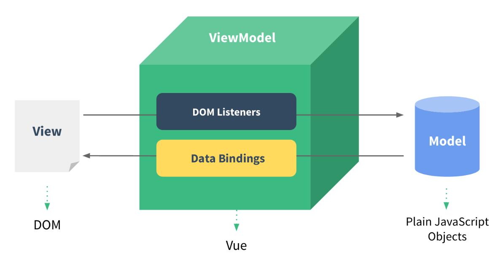
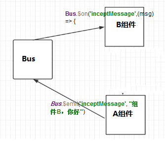

# 1 Vue介绍

## 1.1 为什么要学习流行框架

- 企业为了提高开发效率：在企业中，时间就是效率，效率就是金钱；


- 企业中，使用框架，能够提高开发的效率；


- 提高开发效率的发展历程：

  原生JS -> Jquery之类的类库 -> 前端模板引擎 -> Angular.js / Vue.js（能够帮助我们减少不必要的DOM操作；提高渲染效率）


## 1.2 框架和库的区别

- 框架：是一套完整的解决方案；对项目的侵入性较大，项目如果需要更换框架，则需要重新架构整个项目。

  node 中的 express；

- 库（插件）：提供某一个小功能，对项目的侵入性较小，如果某个库无法完成某些需求，可以很容易切换到其它库实现需求。

  1.从Jquery 切换到 Zepto

  2.从 EJS 切换到 art-template

## 1.3 什么是Vue.js

[Vue官网](https://cn.vuejs.org/v2/api/)

+ Vue.js是是一套用于构建用户界面的**渐进式框架**，是目前最火的一个前端框架，React是最流行的一个前端框架（React除了开发网站，还可以开发手机App， Vue语法也是可以用于进行手机App开发的，需要借助于Weex）

  ```
  渐进式代表的含义是：没有多做职责之外的事。vue.js只提供了 vue-cli 生态中最核心的 组件系统 和 双向数据绑定。像vuex、vue-router都属于围绕 vue.js开发的库，可以集成也可以不集成。
  ```

  

+ Vue.js 是前端的**主流框架之一**，和Angular.js、React.js 一起，并成为前端三大主流框架！

+ Vue.js 是一套构建用户界面的框架，**只关注视图层**，它不仅易于上手，还便于与第三方库或既有项目整合。（Vue有配套的第三方类库，可以整合起来做大型项目的开发）

## 1.4. Vue的核心思想

> - 数据驱动，没有dom操作，页面显示由数据驱动
> - 组件化，一个页面可以划分成很多组件
> - 状态管理 ，vuex，可用于在多个页面之间进行数据共享

## 1.5 MVC和MVVM

### a) MVC

> M - Model ：数据保存
>
> V - View : 用户界面
>
> C - Controller ： 业务逻辑

用户操作--> View (负责接受用户的输入操作)-->Controller（业务逻辑处理）-->Model（数据持久化）-->View（将结果通过View反馈给用户）


MVC有两个很明显的问题：

> 1.m层和v层直接打交道，导致这两层耦合度高，数据流向双向
>
> 2.因为所有逻辑都写在c层，导致c层特别臃肿

### b) MVVM

前端应用的复杂程度已不同往日，暴露出了三个痛点问题：

> 1.开发者在代码中大量调用相同的DOM API, 处理繁琐，操作冗余，使得代码难以维护。
>
> 2.大量的DOM 操作使页面渲染性能降低，加载速度变慢，影响用户体验。
>
> 3.当 Model 频繁发生变化，开发者需要主动更新到View ；当用户的操作导致Model发生变化，开发者同样需要将变化的数据同步到Model中， 这样的工作不仅繁琐，而且很难维护复杂多变的数据状态。
>

早期 jQuery 的出现就是为了前端能更简洁的操作DOM 而设计的，但它只解决了第一个问题，另外两个问题始终伴随着前端一直存在。

MVVM 的出现，完美解决了以上三个问题，MVVM 包含的三部分：

> 1.Model 层代表数据模型，也可以在Model中定义数据修改和操作的业务逻辑；
>
> 2.View 代表UI 组件，它负责将数据模型转化成UI 展现出来
>
> 3.ViewModel 是一个同步View 和 Model的对象。View 和 Model 之间并没有直接的联系，而是通过ViewModel进行交互。ViewModel 层，它就像是一个中转站（value converter），负责转换 Model 中的数据对象来让数据变得更容易管理和使用，该层向上与视图层进行双向数据绑定，向下与 Model 层通过接口请求进行数据交互，起呈上启下作用。



MVVM 模式采用双向绑定（data-binding）：View的变动，自动反映在 ViewModel，反之亦然，而View 和 Model 之间的同步工作完全是自动的，无需人为干涉，因此开发者只需关注业务逻辑，不需要手动操作DOM, 不需要关注数据状态的同步问题，复杂的数据状态维护完全由 MVVM 来统一管理。angular 和vue都采用这种模式。

# 2 Vue基本语法

## 2.1 基本使用

```html
<!DOCTYPE html>
<html lang="en">

<head>
  <meta charset="UTF-8">
  <meta name="viewport" content="width=device-width, initial-scale=1.0">
  <meta http-equiv="X-UA-Compatible" content="ie=edge">
  <title>Document</title>
  <!-- 1. 导入Vue的包 -->
  <script src="./lib/vue-2.4.0.js"></script>
</head>

<body>
  <!-- id="app" : app指的是将来 new 的Vue实例，会控制这个元素中的所有内容 -->
  <!-- Vue 实例所控制的这个元素区域，就是我们的 View  -->
  <div id="app">
    <p>{{ msg }}</p>
  </div>

  <script>
    // 2. 创建一个Vue的实例，就是我们 MVVM中的 ViewModel
    //  当我们导入包之后，在浏览器的内存中，就多了一个 Vue 构造函数
    var vm = new Vue({
	  // 表示当前我们 new 的这个 Vue 实例，要控制页面上的哪个区域
      el: '#app',  
      // 这里的 data 就是 MVVM中的 Model，专门用来保存每个页面的数据的
      data: { 
		// data 属性中，存放的是el中要用到的数据
        msg: '欢迎学习Vue' // 通过 Vue 提供的指令，很方便的就能把数据渲染到页面上，程序员不再手动操作DOM元素了【前端的Vue之类的框架，不提倡我们去手动操作DOM元素了】
      }
    })
  </script>
</body>

</html>
```

```javascript
//mustache 插值表达式的特点：必须是一句话，必须有返回值
{{number+1}}
{{ok?"YES":"NO"}}
{{message.split("").reverse().join("-")}}
```

## 2.2 常用指令

- v-cloak
- v-text
- v-html
- v-bind
- v-on

```html
<!DOCTYPE html>
<html lang="en">

<head>
  <meta charset="UTF-8">
  <meta name="viewport" content="width=device-width, initial-scale=1.0">
  <meta http-equiv="X-UA-Compatible" content="ie=edge">
  <title>Document</title>
  <style>
    [v-cloak] {
      display: none;
    }
  </style>
</head>

<body>
  <div id="app">
    <!-- 使用 v-cloak 能够解决 插值表达式闪烁的问题  vue-2.4.0.js的加载需要时间，在vue-2.4.0.js没有成功加载之前，页面会显示{ {msg}}文本信息 -->
    <p v-cloak>++++++++ {{ msg }} ----------</p>
    <h4 v-text="msg">==================</h4>
    <!-- 默认 v-text 是没有闪烁问题的 -->
    <!-- v-text会覆盖元素中原本的内容，但是插值表达式只会替换自己的这个占位符，不会把整个元素的内容清空 -->
    <div>{{msg2}}</div>
    <div v-text="msg2"></div>
	 <!-- v-html会覆盖元素中原本的内容，只不过会将msg2当做html文本进行解析 -->
    <div v-html="msg2">1212112</div>

    <!-- v-bind: 是Vue中提供的用于绑定属性的指令，v-bind 中，可以写合法的JS表达式 -->
    <input type="button" value="按钮1" v-bind:title="mytitle + '123'"> 
    <!-- 注意： v-bind: 指令可以被简写为 :要绑定的属性 -->
	 <input type="button" value="按钮2" :title="mytitle + '3455'"> 


    <!-- Vue 中提供了 v-on: 事件绑定机制
          下面代码错误：因为vue会将alert理解为一个变量，而在Vue中我们并没有定义alert变量，所以找不到	-->
    <!-- <input type="button" value="按钮3" :title="mytitle + '888'" v-on:click="alert('hello')">-->

	<!--v-on:click可以简写成@click-->
    <input type="button" value="按钮4" @click="show">
  </div>


  <script src="./lib/vue-2.4.0.js"></script>

  <script>
    var vm = new Vue({
      el: '#app',
      data: {
        msg: '123',
        msg2: '<h1>哈哈，我是一个大大的H1， 我大，我骄傲</h1>',
        mytitle: '这是一个自己定义的title'
      },
      methods: { 
        // 这个 methods属性中定义了当前Vue实例所有可用的方法
        show: function () {
          alert('Hello')
        }
      }
    })

    /*
	//在vue中不推荐我们再去使用dom操作的方法
	document.getElementById('btn').onclick = function(){
      alert('Hello')
    } */
  </script>
</body>

</html>
```

## 2.3 跑马灯效果

```html
<!DOCTYPE html>
<html lang="en">

<head>
  <meta charset="UTF-8">
  <meta name="viewport" content="width=device-width, initial-scale=1.0">
  <meta http-equiv="X-UA-Compatible" content="ie=edge">
  <title>Document</title>
  <!-- 1. 导入Vue包 -->
  <script src="./lib/vue-2.4.0.js"></script>
</head>

<body>
  <!-- 2. 创建一个要控制的区域 -->
  <div id="app">
    <input type="button" value="浪起来" @click="lang">
    <input type="button" value="低调" @click="stop">

    <h4>{{ msg }}</h4>

  </div>

  <script>
    // 注意：在VM实例中，如果想要获取data上的数据，或者想要调用methods中的方法，必须通过this.数据属性名或this.方法名来进行访问，这里的this，就表示我们new出来的VM 实例对象
    var vm = new Vue({
      el: '#app',
      data: {
        msg: '猥琐发育，别浪~~！',
        intervalId: null // 在data上定义定时器Id
      },
      methods: {
        lang() {

          if (this.intervalId != null) return;

          this.intervalId = setInterval(() => {
            var start = this.msg.substring(0, 1)
            // 获取到后面的所有字符
            var end = this.msg.substring(1)
            // 重新拼接得到新的字符串，并赋值给 this.msg
            this.msg = end + start
          }, 400)

          // 注意： VM实例，会监听自己身上data中所有数据的改变，只要数据一发生变化，就会自动把最新的数据从data上同步到页面中去；
		  //【好处：程序员只需要关心数据，不需要考虑如何重新渲染DOM页面】
        },
        stop() { 
		  //停止定时器
          clearInterval(this.intervalId)
          //每当清除了定时器之后，需要重新把 intervalId 置为 null
          this.intervalId = null;
        }
      }
    })
  </script>
</body>

</html>
```

## 2.4 事件修饰符

- .stop       阻止冒泡
- .prevent    阻止默认事件
- .capture    添加事件侦听器时使用事件捕获模式
- .self       只当事件在该元素本身（比如不是子元素）触发时触发回调
- .once       事件只触发一次

```html
<!DOCTYPE html>
<html lang="en">

<head>
  <meta charset="UTF-8">
  <meta name="viewport" content="width=device-width, initial-scale=1.0">
  <meta http-equiv="X-UA-Compatible" content="ie=edge">
  <title>Document</title>
  <script src="./lib/vue-2.4.0.js"></script>
  <style>
    .inner {
      height: 150px;
      background-color: darkcyan;
    }

    .outer {
      padding: 40px;
      background-color: red;
    }
  </style>
</head>

<body>
  <div id="app">

    <!-- 使用  .stop  阻止冒泡 -->
    <div class="inner" @click="div1Handler">
      <input type="button" value="阻止冒泡" @click.stop="btnHandler">
    </div>

    <!-- 使用 .prevent 阻止默认行为 -->
    <a href="http://www.baidu.com" @click.prevent="linkClick">阻止默认行为</a> 

    <!-- 使用  .capture 实现捕获触发事件的机制 。打印顺序从外向里 -->
    <div class="inner" @click.capture="div1Handler">
      <input type="button" value="捕获事件" @click="btnHandler">
    </div> 

    <!-- 使用 .self 实现只有点击当前元素时候，才会触发事件处理函数 -->
    <div class="inner" @click="div1Handler.self">
      <input type="button" value="self" @click="btnHandler">
    </div>

    <!-- 使用 .once 只触发一次事件处理函数 -->
    <span href="http://www.baidu.com" @click.once="spanClick">只能触发一次</span>

    <!-- 演示： .stop 和 .self 的区别 -->
	<!--.stop阻止所有的冒泡-->
    <div class="outer" @click="div2Handler">
      <div class="inner" @click="div1Handler">
        <input type="button" value="stop" @click.stop="btnHandler">
      </div>
    </div>

    <!-- .self 只有点击当前元素才会触发点击事件。如果子元素的事件冒泡到自己身上，不会执行该事件 -->
    <div class="outer" @click="div2Handler">
      <div class="inner" @click.self="div1Handler">
        <input type="button" value="self" @click="btnHandler">
      </div>
    </div> 

  </div>

  <script>
    // 创建 Vue 实例，得到 ViewModel
    var vm = new Vue({
      el: '#app',
      data: {},
      methods: {
        div1Handler() {
          console.log('这是触发了 inner div 的点击事件')
        },
        btnHandler() {
          console.log('这是触发了 btn 按钮 的点击事件')
        },
        linkClick() {
          console.log('触发了连接的点击事件')
        },
        div2Handler() {
          console.log('这是触发了 outer div 的点击事件')
        },
        spanClick(){
          console.log('spanClick')
        }
      }
    });
  </script>
</body>

</html>
```

## 2.5 v-model和双向绑定

只有v-model指令实现了双向绑定， v-model 只能运用在表单元素中。如： input(radio, text, address, email....)   select    checkbox   textarea

```html
<!DOCTYPE html>
<html>
	<head>
		<meta charset="utf-8" />
		<title></title>
	</head>
	<body>
		<form id="app" action="#">
		    <p><input  v-model="email"></p>
		    <p><input v-model="name"></p>
		    <button @click="modify">点我修改数据源</button>
		    <button @click="show">改完表单再点我</button>
		</form>
	</body>
</html>
<script src="lib/vue-2.4.0.js"></script>

<script>
	var vm = new Vue({
	  el: '#app',
      data: {
        email: 'zhangsan@qq.com',
        name: 'zhangsan'
      },
      methods:{
      	modify:function(){
      		this.email = 'lisi@.qq.com';
      	},
      	show:function(){
      		alert(this.email);
      	}
      }
	})
</script>
```

## 2.6 双向绑定-计算器案例

```html
<!DOCTYPE html>
<html lang="en">

<head>
  <meta charset="UTF-8">
  <meta name="viewport" content="width=device-width, initial-scale=1.0">
  <meta http-equiv="X-UA-Compatible" content="ie=edge">
  <title>Document</title>
  <script src="./lib/vue-2.4.0.js"></script>
</head>

<body>
  <div id="app">
    <input type="text" v-model="n1">

    <select v-model="opt">
      <option value="+">+</option>
      <option value="-">-</option>
      <option value="*">*</option>
      <option value="/">/</option>
    </select>

    <input type="text" v-model="n2">

    <input type="button" value="=" @click="calc">

    <input type="text" v-model="result">
  </div>

  <script>
    // 创建 Vue 实例，得到 ViewModel
    var vm = new Vue({
      el: '#app',
      data: {
        n1: 0,
        n2: 0,
        result: 0,
        opt: '+'
      },
      methods: {
        calc() { // 计算器算数的方法  
          // 逻辑：
          switch (this.opt) {
            case '+':
              this.result = parseInt(this.n1) + parseInt(this.n2)
              break;
            case '-':
              this.result = parseInt(this.n1) - parseInt(this.n2)
              break;
            case '*':
              this.result = parseInt(this.n1) * parseInt(this.n2)
              break;
            case '/':
              this.result = parseInt(this.n1) / parseInt(this.n2)
              break;
          }
        }
      }
    });
  </script>
</body>

</html>
```

## 2.7 双向绑定的原理

### a) 页面-->数据

view更新data只需要添加DOM事件监听即可，比如input标签监听 'input' 事件就可以实现

### b) 数据-->页面

是通过数据劫持 + 发布者-订阅者模式的方式来实现的

#### (1).数据劫持

vue是通过Object.defineProperty()来实现数据劫持的。(vue3.0已换成proxy来实现数据劫持)

```javascript
var book = {}
Object.defineProperty(book, 'name', {
    set: function (value) {
        name = value;
        console.log('你取了一个书名叫做' + value);
    },
    get: function () {
        return '《' + name + '》'
    }
})

book.name = 'vue权威指南';  // 你取了一个书名叫做vue权威指南
book.name = 'vue权威指南2';  // 你取了一个书名叫做vue权威指南
console.log(book.name);  // 《vue权威指南》
```

#### (2).发布者订阅模式

```javascript
//订阅器
function Dept() {
    this.watchers = [];
}
Dept.prototype.addWatcher = function (watcher) {
    this.watchers.push(watcher);
}
Dept.prototype.notifyWatcher = function (value) {
    this.watchers.forEach(function (watcher) {
        watcher.update(value);
    });
}

//订阅者
function Watcher(name){
    this.name = name;
}
Watcher.prototype.update = function(value){
    console.log(this.name+"接收到新天气"+value+"，准备干啥");
}

//创建几个订阅者
var xiaoming = new Watcher("小明");
var xiaohong = new Watcher("小红");
var xiaohei = new Watcher("小黑");

//创建一个订阅器
var dept = new Dept();
dept.addWatcher(xiaoming);
dept.addWatcher(xiaohong);
dept.addWatcher(xiaohei);


//数据劫持常用方案：Object.defineProperty(Vue 2.0)    Proxy(Vue 3.0)
//数据劫持的主要作用：劫持数据的变化
var weatherStation = {};
Object.defineProperty(weatherStation, "weather", {
    //当在外部给book的name属性赋值的时候，会执行set
    set: function (value) {
        name = value;
        //一旦天气变化，订阅器通知所有的观察者去更新
        dept.notifyWatcher(value);
    },
    //当在外部获取book的name属性的时候，会执行get
    get: function () {
        return "当前天气是" + name;
    }
})
weatherStation.weather = "晴天";
weatherStation.weather = "冰雹";
```

#### (3).数据绑定的实现流程

首先要对数据进行劫持监听，所以我们需要设置一个监听器Observer，用来监听所有属性。如果属性发上变化了，就需要告诉订阅者Watcher看是否需要更新。

因为订阅者是有很多个，所以我们需要有一个消息订阅器Dep来专门收集这些订阅者，然后在监听器Observer和订阅者Watcher之间进行统一管理的。

接着，我们还需要有一个指令解析器Compile，对每个节点元素进行扫描和解析，将相关指令对应初始化成一个订阅者Watcher，并替换模板数据或者绑定相应的函数，此时当订阅者Watcher接收到相应属性的变化，就会执行对应的更新函数，从而更新视图。

因此接下去我们执行以下3个步骤，实现数据的双向绑定：

> 1.监听器Observer，用来劫持并监听所有属性，如果有变动的，就通知所有订阅者。
>
> 2.订阅者Watcher，可以收到属性的变化通知并执行相应的函数，从而更新视图。
>
> 3.解析器Compile，可以扫描和解析每个节点的相关指令，并根据初始化模板数据以及初始化相应的订阅者


参考链接：https://www.cnblogs.com/libin-1/p/6893712.html

## 2.8 vue样式操作

### a)  class操作

```html
<!DOCTYPE html>
<html lang="en">

<head>
  <meta charset="UTF-8">
  <meta name="viewport" content="width=device-width, initial-scale=1.0">
  <meta http-equiv="X-UA-Compatible" content="ie=edge">
  <title>Document</title>
  <script src="./lib/vue-2.4.0.js"></script>
  <style>
    .red {
      color: red;
    }

    .thin {
      font-weight: 200;
    }

    .italic {
      font-style: italic;
    }

    .active {
      letter-spacing: 1.5em;
    }
  </style>
</head>

<body>
  <div id="app">
    <h1 class="red thin">这是一个很大很大的H1，大到你无法想象！！！</h1> 

    <!-- 第一种使用方式，直接传递一个数组，注意：这里的class需要使用  v-bind 做数据绑定 -->
    <h1 :class="['thin', 'italic']">这是一个很大很大的H1，大到你无法想象！！！</h1>

    <!-- 在数组中使用三元表达式 -->
    <h1 :class="['thin', 'italic', flag?'active':'']">这是一个很大很大的H1，大到你无法想象！！！</h1> 

    <!-- 在数组中使用对象来代替三元表达式，提高代码的可读性 -->
    <h1 :class="['thin', 'italic', {'active':flag} ]">这是一个很大很大的H1，大到你无法想象！！！</h1> 

    <!-- 在为class使用v-bind绑定对象的时候，对象的属性是类名，属性的值是一个标识符 -->
    <h1 :class="classObj">这是一个很大很大的H1，大到你无法想象！！！</h1>
  </div>

  <script>
    // 创建 Vue 实例，得到 ViewModel
    var vm = new Vue({
      el: '#app',
      data: {
        flag: true,
        classObj: { red: true, thin: true, italic: false, active: false }
      },
      methods: {}
    });
  </script>
</body>

</html><!DOCTYPE html>
<html lang="en">
```

### b)  style操作

```html
<!DOCTYPE html>
<html lang="en">

<head>
  <meta charset="UTF-8">
  <meta name="viewport" content="width=device-width, initial-scale=1.0">
  <meta http-equiv="X-UA-Compatible" content="ie=edge">
  <title>Document</title>
  <script src="./lib/vue-2.4.0.js"></script>
</head>

<body>
  <div id="app">
    <!-- 对象就是无序键值对的集合 -->
    <h1 :style="styleObj1">标题1</h1> 

    <h1 :style="[styleObj1,styleObj2]">标题2</h1>
  </div>

  <script>
    // 创建 Vue 实例，得到 ViewModel
    var vm = new Vue({
      el: '#app',
      data: {
        styleObj1: { color: 'red', 'font-weight': 200 },
        styleObj2: { 'font-style': 'italic' }
      },
      methods: {}
    });
  </script>
</body>

</html>
```

## 2.9 vue循环

### a) 循环普通数据

```html
<!DOCTYPE html>
<html lang="en">

<head>
  <meta charset="UTF-8">
  <meta name="viewport" content="width=device-width, initial-scale=1.0">
  <meta http-equiv="X-UA-Compatible" content="ie=edge">
  <title>Document</title>
  <script src="./lib/vue-2.4.0.js"></script>
</head>

    
<body>
  <div id="app">
    <p>{{list[0]}}</p>
    <p>{{list[1]}}</p>
    <p>{{list[2]}}</p>
    <p>{{list[3]}}</p>
    <p>{{list[4]}}</p>
	
	<p>--------------------------------------------</p>

    <p v-for="(item, i) in list">索引值：{{i}} --- 每一项：{{item}}</p>
  </div>

  <script>
    // 创建 Vue 实例，得到 ViewModel
    var vm = new Vue({
      el: '#app',
      data: {
        list: [1, 2, 3, 4, 5, 6]
      },
      methods: {}
    });
  </script>
</body>

</html>
```

### b) 循环对象数组

```html
<!DOCTYPE html>
<html lang="en">

<head>
  <meta charset="UTF-8">
  <meta name="viewport" content="width=device-width, initial-scale=1.0">
  <meta http-equiv="X-UA-Compatible" content="ie=edge">
  <title>Document</title>
  <script src="./lib/vue-2.4.0.js"></script>
</head>

<body>
  <div id="app">
    <p v-for="(user, i) in list">Id：{{ user.id }} --- 名字：{{ user.name }} --- 索引：{{i}}</p>
  </div>
 
  <script>
    // 创建 Vue 实例，得到 ViewModel
    var vm = new Vue({
      el: '#app',
      data: {
        list: [
          { id: 1, name: 'zs1' },
          { id: 2, name: 'zs2' },
          { id: 3, name: 'zs3' },
          { id: 4, name: 'zs4' }
        ]
      },
      methods: {}
    });
  </script>
</body>

</html>
```

### c) 循环对象

```html
<!DOCTYPE html>
<html lang="en">

<head>
  <meta charset="UTF-8">
  <meta name="viewport" content="width=device-width, initial-scale=1.0">
  <meta http-equiv="X-UA-Compatible" content="ie=edge">
  <title>Document</title>
  <script src="./lib/vue-2.4.0.js"></script>
</head>

<body>
  <div id="app">
    <!-- 注意：在遍历对象身上的键值对的时候， 除了 有  val  key  ,在第三个位置还有 一个 索引  -->
    <p v-for="(val, key, i) in user">值是： {{ val }} --- 键是： {{key}} -- 索引： {{i}}</p>
  </div>

  <script>
    // 创建 Vue 实例，得到 ViewModel
    var vm = new Vue({
      el: '#app',
      data: {
        user: {
          id: 1,
          name: '托尼·屎大颗',
          gender: '男'
        }
      },
      methods: {}
    });
  </script>
</body>

</html>
```

### d) 循环数字

```html
<!DOCTYPE html>
<html lang="en">

<head>
  <meta charset="UTF-8">
  <meta name="viewport" content="width=device-width, initial-scale=1.0">
  <meta http-equiv="X-UA-Compatible" content="ie=edge">
  <title>Document</title>
  <script src="./lib/vue-2.4.0.js"></script>
</head>

<body>
  <div id="app">
    <!-- in 后面还可以放数字 -->
    <!-- 注意：如果使用 v-for 迭代数字的话，前面的 count 值从 1 开始 -->
    <p v-for="count in 10">这是第 {{ count }} 次循环</p>
  </div>

  <script>
    // 创建 Vue 实例，得到 ViewModel
    var vm = new Vue({
      el: '#app',
      data: {},
      methods: {}
    });
  </script>
</body>

</html>
```

### e) 循环中key的使用

当 Vue.js 用 v-for 正在更新已渲染过的元素列表时，它默认用 “**就地复用**” 策略。如果数据项的顺序被改变，Vue将**不是移动 DOM 元素来匹配数据项的顺序**， 而是**简单复用此处每个元素**，并且确保它在特定索引下显示已被渲染过的每个元素。

为了给 Vue 一个提示，**以便它能跟踪每个节点的身份，从而重用和重新排序现有元素**，你需要为每项提供一个唯一 key 属性。

```html
<!DOCTYPE html>
<html lang="en">

<head>
  <meta charset="UTF-8">
  <meta name="viewport" content="width=device-width, initial-scale=1.0">
  <meta http-equiv="X-UA-Compatible" content="ie=edge">
  <title>Document</title>
  <script src="./lib/vue-2.4.0.js"></script>
</head>

<body>
  <div id="app">

    <div>
      <label>Id:
        <input type="text" v-model="id">
      </label>

      <label>Name:
        <input type="text" v-model="name">
      </label>

      <input type="button" value="添加" @click="add">
    </div>

	<!--:key的作用：保证数据和页面的关联，让数据和页面一一对应。这个地方如果不加key，在给某一个input打钩之后再新增数据就会出现问题-->
    <!-- 注意： v-for 循环的时候，key 属性的值只能是number或者string，否则报错 -->
    <p v-for="item in list" :key="item.id">
      <input type="checkbox">{{item.id}} --- {{item.name}}
    </p>
  </div>

  <script>
    // 创建 Vue 实例，得到 ViewModel
    var vm = new Vue({
      el: '#app',
      data: {
        id: '',
        name: '',
        list: [
          { id: 1, name: '李斯' },
          { id: 2, name: '嬴政' },
          { id: 3, name: '赵高' },
          { id: 4, name: '韩非' },
          { id: 5, name: '荀子' }
        ]
      },
      methods: {
        add() { // 添加方法
          this.list.unshift({ id: this.id, name: this.name })
        }
      }
    });
  </script>
</body>

</html>
```

## 2.10 v-if和v-show

	一般来说，v-if 有更高的切换消耗而 v-show 有更高的初始渲染消耗。因此，如果需要频繁切换 v-show 较好，如果在运行时条件不大可能改变 v-if 较好。

```html
<!DOCTYPE html>
<html lang="en">

<head>
  <meta charset="UTF-8">
  <meta name="viewport" content="width=device-width, initial-scale=1.0">
  <meta http-equiv="X-UA-Compatible" content="ie=edge">
  <title>Document</title>
  <script src="./lib/vue-2.4.0.js"></script>
</head>

<body>
  <div id="app">

    <input type="button" value="toffle1" @click="toggle"> 
    <input type="button" value="toggle2" @click="flag=!flag">

    <!-- v-if 的特点：每次都会重新删除或创建元素,有较高的切换性能消耗 -->
    <!-- v-show 的特点： 每次不会重新进行DOM的删除和创建操作，只是切换了元素的 display:none 样式 -->

    <!-- 如果元素涉及到频繁的切换，最好不要使用 v-if, 而是推荐使用 v-show -->
    <!-- 如果元素可能永远也不会被显示出来被用户看到，则推荐使用 v-if -->
    <h3 v-if="flag">这是用v-if控制的元素</h3>
    <h3 v-show="flag">这是用v-show控制的元素</h3>
  </div>

  <script>
    // 创建 Vue 实例，得到 ViewModel
    var vm = new Vue({
      el: '#app',
      data: {
        flag: false
      },
      methods: {
        toggle() {
          this.flag = !this.flag
        } 
      }
    });
  </script>
</body>

</html>
```

## 2.11 品牌管理案例

```html
<!DOCTYPE html>
<html lang="en">

<head>
  <meta charset="UTF-8">
  <meta name="viewport" content="width=device-width, initial-scale=1.0">
  <meta http-equiv="X-UA-Compatible" content="ie=edge">
  <title>Document</title>
  <script src="./lib/vue-2.4.0.js"></script>
  <link rel="stylesheet" href="./lib/bootstrap-3.3.7.css">
</head>

<body>
  <div id="app">
    <div class="panel panel-primary">
      <div class="panel-heading">
        <h3 class="panel-title">添加品牌</h3>
      </div>
      <div class="panel-body form-inline">
        <label>
          Id:
          <input type="text" class="form-control" v-model="id">
        </label>

        <label>
          Name:
          <input type="text" class="form-control" v-model="name">
        </label>

        <!-- 在Vue中，使用事件绑定机制，为元素指定处理函数的时候，如果加了小括号，就可以给函数传参了 -->
        <input type="button" value="添加" class="btn btn-primary" @click="add()">

        <label>
          搜索名称关键字：
          <input type="text" class="form-control" v-model="keywords">
        </label>
      </div>
    </div>


    <table class="table table-bordered table-hover table-striped">
      <thead>
        <tr>
          <th>Id</th>
          <th>Name</th>
          <th>Ctime</th>
          <th>Operation</th>
        </tr>
      </thead>
      <tbody>
        <!-- 之前， v-for中的数据，都是直接从data上的list中直接渲染过来的 -->
        <!-- 现在， 我们自定义了一个search方法，调用这个方法获取数据 -->
        <!-- 在 search 方法内部，通过执行for循环， 把所有符合搜索关键字的数据，保存到 一个新数组中返回 -->
        <tr v-for="item in search()" :key="item.id">
          <td>{{ item.id }}</td>
          <td v-text="item.name"></td>
          <td>{{ item.ctime }}</td>
          <td>
            <a href="" @click.prevent="del(item.id)">删除</a>
          </td>
        </tr>
      </tbody>
    </table>
  </div>

  <script>
    // 创建 Vue 实例，得到 ViewModel
    var vm = new Vue({
      el: '#app',
      data: {
        id: '',
        name: '',
        keywords: '', // 搜索的关键字
        list: [
          { id: 1, name: '奔驰', ctime: new Date() },
          { id: 2, name: '宝马', ctime: new Date() }
        ]
      },
      methods: {
        add() { // 添加的方法
          var car = { id: this.id, name: this.name, ctime: new Date() }
          this.list.push(car)
          this.id = this.name = ''
        },
        del(id) { // 根据Id删除数据
          var index = this.list.findIndex(item => {
            if (item.id == id) {
              return true;
            }
          })
          this.list.splice(index, 1)
        },
        search() { 
          // 根据关键字，进行数据的搜索
          // 注意：  forEach   some   filter   findIndex   这些都属于数组的新方法，都会对数组中的每一项，进行遍历，执行相关的操作；
          return this.list.filter(item => {
            // if(item.name.indexOf(keywords) != -1)

            // 注意 ： ES6中，为字符串提供了一个新方法，叫做  String.prototype.includes('要包含的字符串')。如果包含，则返回 true ，否则返回 false
            if (item.name.includes(this.keywords)) {
              return item
            }
          })
        }
      }
    });
  </script>
</body>

</html>
```

## 2.12 Vue-devtools

#### a) 将vue-devtools拷贝到本地

https://github.com/vuejs/vue-devtools.git

#### b) 在vue-devtools目录下安装依赖包

```javascript
cd vue-devtools
npm install
```

#### c) 编译代码

```javascript
npm run build
```

#### d) 修改manifest.json文件

修改   `vue-devtools/shells/chrome/manifest.json `文件，将 persistent改成 true

#### e) 添加谷歌扩展程序

    打开开发者模式
    启用vue-devtools
    允许访问文件地址

# 3 过滤器、按键修饰符、自定义指令

## 3.1 过滤器

概念：Vue.js 允许你自定义过滤器，可被用作一些常见的文本格式化。过滤器可以用在两个地方：mustache 插值和 v-bind 表达式。过滤器应该被添加在 JavaScript 表达式的尾部，由“管道”符指示；

### 3.1.1 私有过滤器

1. HTML元素：

```javascript
<p>{{ msg | msgFormat('疯狂+1', '123') | test }}</p>
```

2. 私有 `filters` 定义方式：

```javascript
<body>
  <script>
    // 创建 Vue 实例，得到 ViewModel
    var vm = new Vue({
      el: '#app',
      data: {
        msg: '曾经，我也是一个单纯的少年，单纯的我，傻傻的问，谁是世界上最单纯的男人'
      },
      methods: {},
	  filters: { 
        // 过滤器的三个参数：1.要过滤的文本   2.过滤的内容   3.替换的内容
        // 过滤器调用的时候，采用的是就近原则，如果私有过滤器和全局过滤器名称一致了，这时候优先调用私有过滤器
        msgFormat: function (msg, arg, arg2) {
           // 字符串的  replace 方法，第一个参数，除了可写一个 字符串之外，还可以定义一个正则
		   return msg.replace(/少年/g, arg + arg2)
        }
      },
    });
  </script>
</body>
```

### 3.1.2 全局过滤器

```javascript
<body>
  <div id="app">
    <p>{{ msg | msgFormat('疯狂+1', '123') | test }}</p>
  </div>

  <script>
    // 定义一个 Vue 全局的过滤器，名字叫做  msgFormat
    Vue.filter('msgFormat', function (msg, arg, arg2) {
      // 字符串的  replace 方法，第一个参数，除了可写一个 字符串之外，还可以定义一个正则
      return msg.replace(/单纯/g, arg + arg2)
    })

    Vue.filter('test', function (msg) {
      return msg + '========'
    })

    // 创建 Vue 实例，得到 ViewModel
    var vm = new Vue({
      el: '#app',
      data: {
        msg: '曾经，我也是一个单纯的少年，单纯的我，傻傻的问，谁是世界上最单纯的男人'
      },
      methods: {}
    });
  </script>
</body>
```

> 注意：当有局部和全局两个名称相同的过滤器时候，会以就近原则进行调用，即：局部过滤器优先于全局过滤器被调用！

## 3.2 键盘修饰符

### 3.2.1  键盘修饰符

https://cn.vuejs.org/v2/guide/events.html#%E6%8C%89%E9%94%AE%E4%BF%AE%E9%A5%B0%E7%AC%A6

```javascript
<input type="text" class="form-control" v-model="name" @keyup.enter="add">
```

### 3.3.2 自定义键盘修饰符

1. 通过`Vue.config.keyCodes.名称 = 按键值`来自定义案件修饰符的别名：

```javascript
//约定113对应f2
Vue.config.keyCodes.f2 = 113;
```

2. 使用自定义的按键修饰符：

```javascript
<input type="text" v-model="name" @keyup.f2="add">
```

## 3.3 自定义指令

https://cn.vuejs.org/v2/guide/custom-directive.html

### 3.3.1 自定义全局指令

```javascript
// 自定义全局指令 v-focus，为绑定的元素自动获取焦点：
// 其中：参数1 ： 指令的名称，注意，在定义的时候，指令的名称前面，不需要加 v- 前缀, 但是： 在调用的时候，必须 在指令名称前 加上 v- 前缀来进行调用
//           参数2： 是一个对象，这个对象身上，有一些指令相关的函数，这些函数可以在特定的阶段，执行相关的操作
Vue.directive('focus', {
    bind: function (el) { 
        // 每当指令绑定到元素上的时候，会立即执行这个bind 函数，只执行一次
        // 注意： 在每个函数中，第一个参数永远是el，表示被绑定了指令的那个元素，这个el参数，是一个原生的JS对象
        // 在元素刚绑定了指令的时候还没有插入到DOM中去的时候调用focus方法没有作用。因为，一个元素只有插入DOM之后才能获取焦点
        // el.focus()
    },
    inserted: function (el) {  
        // inserted 表示元素 插入到DOM中的时候，会执行 inserted 函数【触发1次】。和JS行为有关的操作，最好在 inserted 中去执行，放置 JS行为不生效
        el.focus()
    },
    update: function (el) {  
        // 当VNode更新的时候，会执行 updated， 可能会触发多次
    }
})
```

### 3.3.2 自定义局部指令

```javascript
// 自定义局部指令 v-color 和 v-font-weight，为绑定的元素设置指定的字体颜色 和 字体粗细：
directives: { 
    // 自定义私有指令
    'fontweight': { 
        // 设置字体粗细的：样式操作可以写在bind方法里面，dom操作需要写在inserted方法里面
        bind: function (el, binding) {
            el.style.fontWeight = binding.value
        }
    },
   'fontsize': function (el, binding) { 
        // 注意：这个 function 等同于把代码写到了 bind 和 update 中去
        el.style.fontSize = parseInt(binding.value) + 'px'
    }
}
```

### 3.3.3 使用自定义指令

```javascript
<h3 v-color="'pink'" v-fontweight="900" v-fontsize="50">这是h3标题</h3>
```

## 3.4 品牌管理案例重写

```html
<!DOCTYPE html>
<html lang="en">

<head>
  <meta charset="UTF-8">
  <meta name="viewport" content="width=device-width, initial-scale=1.0">
  <meta http-equiv="X-UA-Compatible" content="ie=edge">
  <title>Document</title>
  <script src="./lib/vue-2.4.0.js"></script>
  <link rel="stylesheet" href="./lib/bootstrap-3.3.7.css">
</head>

<body>
  <div id="app">
    <div class="panel panel-primary">
      <div class="panel-heading">
        <h3 class="panel-title">添加品牌</h3>
      </div>
      <div class="panel-body form-inline">
        <label>
          Id:
          <input type="text" class="form-control" v-model="id">
        </label>

        <label>
          Name:
		   <!-- 使用自定义键盘修饰符 -->
          <input type="text" class="form-control" v-model="name" @keyup.f2="add">
        </label>

        <!-- 在Vue中，使用事件绑定机制，为元素指定处理函数的时候，如果加了小括号，就可以给函数传参了 -->
        <input type="button" value="添加" class="btn btn-primary" @click="add()">

        <label>
          搜索名称关键字：
          <!-- 注意： Vue中所有的指令，在调用的时候，都以 v- 开头
                 v-focus v-color	自动获取焦点和设置文本颜色为绿色 -->
          <input type="text" class="form-control" v-model="keywords" id="search" v-focus v-color="'green'">
        </label>
      </div>
    </div>

    <table class="table table-bordered table-hover table-striped">
      <thead>
        <tr>
          <th>Id</th>
          <th>Name</th>
          <th>Ctime</th>
          <th>Operation</th>
        </tr>
      </thead>
      <tbody>
        <tr v-for="item in search(keywords)" :key="item.id">
          <td>{{ item.id }}</td>
          <td v-text="item.name"></td>
		   <!-- 过滤器调用时候的格式    {{ name | 过滤器的名称 }} -->
          <td>{{ item.ctime | dateFormat() }}</td>
          <td>
            <a href="" @click.prevent="del(item.id)">删除</a>
          </td>
        </tr>
      </tbody>
    </table>
  </div>

  <div id="app2">
    <h3 v-color="'pink'" v-fontweight="900" v-fontsize="50">{{ dt | dateFormat }}</h3>
  </div>

  <script>
    // 全局的过滤器， 进行时间的格式化
    // 所谓的全局过滤器，就是所有的VM实例都共享的
    Vue.filter('dateFormat', function (dateStr, pattern = "") {
      // 根据给定的时间字符串，得到特定的时间
      var dt = new Date(dateStr)

      //   yyyy-mm-dd
      var y = dt.getFullYear()
      var m = dt.getMonth() + 1
      var d = dt.getDate()

      if (pattern.toLowerCase() === 'yyyy-mm-dd') {
        return `${y}-${m}-${d}`
      } else {
        var hh = dt.getHours()
        var mm = dt.getMinutes()
        var ss = dt.getSeconds()

        return `${y}-${m}-${d} ${hh}:${mm}:${ss}`
      }
    })

    // 自定义全局按键修饰符
    Vue.config.keyCodes.f2 = 113
    // 压缩版的vue.js如果要开启Vue的devtools的需要设置下面代码
	Vue.config.devtools = true

    // Vue.directive()定义全局的指令  v-focus
    Vue.directive('focus', {
      bind: function (el) { 
      },
      inserted: function (el) {  
        el.focus()
      },
      updated: function (el) {  
      }
    })

    // 自定义一个设置字体颜色的指令
    Vue.directive('color', {
      // 样式:只要通过指令绑定给了元素，不管这个元素有没有被插入到页面中去，这个元素肯定有了一个内联的样式
      // 将来元素肯定会显示到页面中，这时候浏览器的渲染引擎必然会解析样式，应用给这个元素
      bind: function (el, binding) {
        // el.style.color = 'red'
        // console.log(binding.name)

        // console.log(binding.value)
        // console.log(binding.expression)

		// 和样式相关的操作，一般都可以在 bind 执行
        el.style.color = binding.value
      }
    })


    // 创建 Vue 实例，得到 ViewModel
    var vm = new Vue({
      el: '#app',
      data: {
        id: '',
        name: '',
        keywords: '', // 搜索的关键字
        list: [
          { id: 1, name: '奔驰', ctime: new Date() },
          { id: 2, name: '宝马', ctime: new Date() }
        ]
      },
      methods: {
        add() { // 添加的方法
          var car = { id: this.id, name: this.name, ctime: new Date() }
          this.list.push(car)
          this.id = this.name = ''
        },
        del(id) { // 根据Id删除数据
          var index = this.list.findIndex(item => {
            if (item.id == id) {
              return true;
            }
          })
          this.list.splice(index, 1)
        },
        search(keywords) { // 根据关键字，进行数据的搜索
          return this.list.filter(item => {
            if (item.name.includes(keywords)) {
              return item
            }
          })
        }
      }
    });


    // 如何自定义一个私有的过滤器（局部）
    var vm2 = new Vue({
      el: '#app2',
      data: {
        dt: new Date()
      },
      methods: {},
      filters: { 
        // 过滤器调用的时候，采用的是就近原则，如果私有过滤器和全局过滤器名称一致了，这时候优先调用私有过滤器
        dateFormat: function (dateStr, pattern = '') {
          // 根据给定的时间字符串，得到特定的时间
          var dt = new Date(dateStr)

          var y = dt.getFullYear()
          var m = (dt.getMonth() + 1).toString().padStart(2, '0')
          var d = dt.getDate().toString().padStart(2, '0')

          if (pattern.toLowerCase() === 'yyyy-mm-dd') {
            return `${y}-${m}-${d}`
          } else {
            var hh = dt.getHours().toString().padStart(2, '0')
            var mm = dt.getMinutes().toString().padStart(2, '0')
            var ss = dt.getSeconds().toString().padStart(2, '0')

            return `${y}-${m}-${d} ${hh}:${mm}:${ss} ~~~~~~~`
          }
        }
      },
      directives: { 
	     // 自定义私有指令
        'fontweight': { 
		  // 设置字体粗细的
          bind: function (el, binding) {
            el.style.fontWeight = binding.value
          }
        },
        'fontsize': function (el, binding) { 
		  // 注意：这个 function 等同于把代码写到了 bind 和 update 中去
          el.style.fontSize = parseInt(binding.value) + 'px'
        }
      }
    })
  </script>
</body>
</html>
```

# 4 Vue的生命周期

## 4.1 生命周期函数

https://cn.vuejs.org/v2/guide/instance.html


```javascript
<!DOCTYPE html>
<html lang="en">

<head>
    <meta charset="UTF-8">
    <meta name="viewport" content="width=device-width, initial-scale=1.0">
    <meta http-equiv="X-UA-Compatible" content="ie=edge">
    <title>Document</title>
    <script src="./lib/vue-2.4.0.js"></script>
</head>

<body>
<div id="app">
    <input type="button" value="修改msg" @click="msg='No'">
    <h3 id="h3">{{ msg }}</h3>
</div>
<template id="demo1">
    <h2>标签模版</h2>
</template>

<script>
    // 创建 Vue 实例，得到 ViewModel
    var vm = new Vue({
        el: '#app',
        //如果没有写template，则会将el的外部html作为模板进行编译
        /*template:"#demo1",*/
        data: {
            msg: 'ok'
        },
        methods: {
            show() {
                console.log('执行了show方法')
            }
        },
        beforeCreate() {
            // 这是我们遇到的第一个生命周期函数，表示实例完全被创建出来之前会执行它
            // console.log(this.msg)
            // this.show()
            // 注意： 在 beforeCreate 生命周期函数执行的时候，data 和 methods 中的数据都还没有没初始化
        },
        created() {
            // 这是遇到的第二个生命周期函数
            // console.log(this.msg)
            // this.show()
            //  在 created 中，data 和 methods 都已经被初始化好了！
            // 如果要调用 methods 中的方法，或者操作 data 中的数据，最早只能在 created 中操作
        },
        beforeMount() {
            // 这是遇到的第3个生命周期函数，表示模板已经在内存中编辑完成了，但是尚未把模板渲染到页面中
            // console.log(document.getElementById('h3').innerText)
            // 在 beforeMount 执行的时候，页面中的元素还没有被真正替换过来，只是之前写的一些模板字符串
        },
        mounted() {
            // 这是遇到的第4个生命周期函数，表示内存中的模板已经真实的挂载到了页面中，用户已经可以看到渲染好的页面了
            // console.log(document.getElementById('h3').innerText)
            // 注意： mounted是实例创建期间的最后一个生命周期函数，当执行完mounted就表示Vue实例已经被完全创建好了，此时如果没有其它操作的话，这个实例就静静的躺在我们的内存中一动不动
        },

        // 接下来的是运行中的两个事件
        beforeUpdate() {
            // 这时候表示数据更新了但是界面还没有被更新
            /* console.log('界面上元素的内容：' + document.getElementById('h3').innerText)
             console.log('data 中的 msg 数据是：' + this.msg) */
            // 得出结论： 当执行 beforeUpdate 的时候，页面中的显示的数据还是旧的，此时 data 数据是最新的，页面尚未和最新的数据保持同步
        },
        updated() {
            console.log('界面上元素的内容：' + document.getElementById('h3').innerText)
            console.log('data 中的 msg 数据是：' + this.msg)
            // updated 事件执行的时候，页面和 data 数据已经保持同步了，都是最新的
        }
    });

    //如果在创建vm实例的时候没有挂载el，可以通过代码手动挂载
    vm.$mount("#app");
</script>
</body>

</html>
```

## 4.2 Vue.nextTick()

### 4.2.1 nextTick介绍

该方法会在下次 DOM 更新循环结束之后执行延迟回调。在修改数据之后立即使用这个方法，获取更新后的 DOM。

应用场景：

> - 在Vue生命周期的`created()`钩子函数进行的DOM操作一定要放在`Vue.nextTick()`的回调函数中
> - 在数据变化后要执行的某个操作，而这个操作需要使用随数据改变而改变的DOM结构的时候，这个操作都应该放进`Vue.nextTick()`的回调函数中。

```javascript
created() {
     //改变数据
    vm.message = 'changed'

    //想要立即使用更新后的DOM。这样不行，因为设置message后DOM还没有更新
    console.log(document.getElementById('testCount').innerHTML) // 并不会得到'changed'

    //这样可以，nextTick里面的代码会在DOM更新后执行
    Vue.nextTick(function(){
        console.log(document.getElementById('testCount').innerHTML) //可以得到'changed'
    })
},
```

### 4.2.2 nextTick()原理

#### a) 异步说明

> Vue 实现响应式并**不是数据发生变化之后 DOM 立即变化**，而是按一定的策略进行 DOM 的更新。

在 Vue 的[文档](https://cn.vuejs.org/v2/guide/reactivity.html#%E5%BC%82%E6%AD%A5%E6%9B%B4%E6%96%B0%E9%98%9F%E5%88%97)中，说明 Vue 是异步执行 DOM 更新的。关于异步的解析，可以查看阮一峰老师的[这篇文章，](http://www.ruanyifeng.com/blog/2014/10/event-loop.html)截取关键部分如下：

具体来说，异步执行的运行机制如下。

> （1）所有同步任务都在主线程上执行，形成一个执行栈（execution context stack）。
> （2）主线程之外，还存在一个"任务队列"（task queue）。只要异步任务有了运行结果，就在"任务队列"之中放置一个事件。
> （3）一旦"执行栈"中的所有同步任务执行完毕，系统就会读取"任务队列"，看看里面有哪些事件。那些对应的异步任务，于是结束等待状态，进入执行栈，开始执行。
> （4）主线程不断重复上面的第三步。

下图就是主线程和任务队列的示意图。


#### b) 事件循环说明	

简单来说，Vue 在修改数据后，视图不会立刻更新，而是等同一事件循环中的所有数据变化完成之后，再统一进行视图更新。图解：


## 4.3 nextTick()案例

```javascript
//点击按钮显示文本输入框，同时让其获取焦点
methods:{
   showsou(){
      this.showit = true
      this.$nextTick(function () {
        // DOM 更新了
        document.getElementById("keywords").focus()
      })
    }
}
```

# 5 axios使用

在vue中，我们可以使用vue-resource去发送请求，也可以使用axios来发送请求
Axios 是一个基于 promise 的 HTTP 库，可以用在浏览器和 node.js 中。
Axios的特点：
•	从浏览器中创建XMLHttpRequests
•	从 node.js 创建http请求
•	支持PromiseAPI
•	拦截请求和响应
•	转换请求数据和响应数据
•	取消请求
•	自动转换 JSON 数据

## 5.1 GER/POST

```javascript
# 这边测试服务器使用品牌列表的服务器

//全局配置axios
axios.defaults.baseURL = 'http://localhost:3000/';
axios.defaults.headers.post['Content-Type'] = 'application/x-www-form-urlencoded';
axios.defaults.withCredentials = true; 

var vm = new Vue({
    el:"#app",
    data:{

    },
    methods:{
        testGet(){
            axios.get('api/getnewslist',{
                params:{

                }
            })
                .then(function (response) {
                console.log(response.data);
            })
                .catch(function (error) {
                console.log(error);
            });
        },
        testPost(){
            axios.post('api/news/new', {
                name: '李宁',
                id: '1001'
            })
                .then(function (response) {
                console.log(response.data);
            })
                .catch(function (error) {
                console.log(error);
            });
        }
    }
})
```

## 5.2 品牌列表案例重写

服务器代码参照资料中code--->brand-list--->server

```javascript
<!DOCTYPE html>
<html lang="en">
<head>
    <meta charset="UTF-8">
    <meta name="viewport" content="width=device-width, initial-scale=1.0">
    <meta http-equiv="X-UA-Compatible" content="ie=edge">
    <title>Document</title>

    <link rel="stylesheet" href="./bootstrap-3.3.7.css">

    <script src="./axios.min.js"></script>
    <script src="./vue-2.4.0.js"></script>
</head>
<body>
    <div id="app">
        <div class="panel panel-primary">
            <div class="panel-heading">
                <h3 class="panel-title">添加品牌</h3>
            </div>
            <div class="panel-body form-inline">
                <label>
                    <!-- ref属性作用：在vue中可以根据this.$refs.ref_value 来获取页面元素 -->
                    Id:<input type="text" class="form-control" v-model="id" v-focus ref="idInput">
                </label>
            
                <label>
                    Name:<input type="text" class="form-control" v-model="name" @keydown.enter="add">
                </label>
        
                <label>
                    搜索名称关键字：<input type="text" class="form-control" v-font_size="30" v-model="keywords">
                </label>
            </div>
        </div>


        <table class="table table-bordered table-hover table-striped">
            <thead>
                <tr>
                    <th>Id</th>
                    <th>Name</th>
                    <th>Ctime</th>
                    <th>Operation</th>
                </tr>
            </thead>
            <tbody>
                <!-- search()是根据keywords搜索内容来过滤数据源的  -->
                <tr v-for="item in search()" :key="item.id">
                    <td>{{item.id}}</td>
                    <td>{{item.name}}</td>
                    <td>{{item.ctime|dateFormatter('yyyy-MM-dd')}}</td>
                    <td><input type="button" value="删除" @click="del(item.id)"></td>
                </tr>
            </tbody>
        </table>
    </div> 
</body>

<script>
    axios.defaults.baseURL = 'http://localhost:3000/';
    axios.defaults.headers.post['Content-Type'] = 'application/x-www-form-urlencoded';

    var vm = new Vue({
        el:"#app",
        data:{
            id:"",
            name:"",
            keywords:"",
            list:[
                {id:1,name:"张三",ctime:new Date()},
                {id:2,name:"李四",ctime:new Date()},
                {id:3,name:"王五",ctime:new Date()},
                {id:4,name:"赵六",ctime:new Date()},
            ]
        },
        //在vue实例创建完毕之后发送请求获取数据
        created(){
            this.getBrandList();
        },
        methods:{
            //获取品牌列表的
            getBrandList(){
                axios.get("api/getnewslist")
                .then(({data})=>{
                    if(data.status == 0){
                        this.list = data.message;
                    }
                    else{
                        this.list = [];
                    }
                })
                .catch(function (error) {
                    console.log(error);
                });
            }
            ,
            add(){
                if(this.id && this.name){
                    axios.post('api/news/new', {
                        name: this.name
                    })
                    .then(()=>{
                        //当添加用户成功之后重新去请求服务器
                        this.getBrandList();
                    })
                    .catch(function (error) {
                        console.log(error);
                    });

                    // //当添加数据完毕之后清空用户输入的内容
                    this.id = "";
                    this.name = "";

                    // //让id文本框获取焦点
                    this.$refs.idInput.focus();
                }
            },
            del(id){
                axios.get("api/news/del/"+id)
                .then(({data})=>{
                    this.getBrandList();
                })
                .catch(function (error) {
                    console.log(error);
                });
            },
            search(){
                return this.list.filter((item)=>{
                    if(item.name.includes(this.keywords)){
                        return item;
                    }
                })
            }
        },
        filters:{
            //默认值参数
            dateFormatter:function(msg,pattern=''){
                //1.将msg时间字符串转换为时间对象
                var dt = new Date(msg)
                //2.获取到年月日时分秒的信息
                var year = dt.getFullYear();
                var month = (dt.getMonth()+1).toString().padStart(2,'0');
                var day = dt.getDate().toString().padStart(2,'0');
                var hour = dt.getHours().toString().padStart(2,'0');
                var minute = dt.getMinutes().toString().padStart(2,'0');
                var second = dt.getSeconds().toString().padStart(2,'0');
                //console.log(year,month,day,hour,minute,second)
                //3.根据pattern返回数据
                if(pattern == 'yyyy-MM-dd'){
                    return `${year}-${month}-${day}`;
                }
                else{
                    return `${year}-${month}-${day} ${hour}:${minute}:${second}`;
                }
            }
        },
        //自定义私有指令
        directives:{
            focus:{
                inserted(el){
                    el.focus();
                }
            },
            font_size:{
                inserted(el,binding){
                    el.style.fontSize = binding.value+"px";
                }
            }
        }
    })

</script>

</html>
```

# 6 Vue中的动画

https://cn.vuejs.org/v2/guide/transitions.html

Vue 在插入、更新或者移除 DOM 时，提供下面的多种不同方式的应用过渡效果。

> - 在 CSS 过渡和动画中自动应用 class ---过渡类名
> - 可以配合使用第三方 CSS 动画库，如 Animate.css
> - 在过渡钩子函数中使用 JavaScript 直接操作 DOM  
> - 可以配合使用第三方 JavaScript 动画库，如 Velocity.js

## 6.1 不使用动画

```html
<!DOCTYPE html>
<html lang="en">

<head>
  <meta charset="UTF-8">
  <meta name="viewport" content="width=device-width, initial-scale=1.0">
  <meta http-equiv="X-UA-Compatible" content="ie=edge">
  <title>Document</title>
  <script src="./lib/vue-2.4.0.js"></script>
</head>

<body>
  <div id="app">
    <input type="button" value="toggle" @click="flag=!flag">
    <!-- 需求： 点击按钮，让 h3 显示，再点击，让 h3 隐藏 -->
    <h3 v-if="flag">这是一个H3</h3>
  </div>

  <script>
    // 创建 Vue 实例，得到 ViewModel
    var vm = new Vue({
      el: '#app',
      data: {
        flag: false
      },
      methods: {}
    });
  </script>
</body>

</html>
```

## 6.2 使用过渡类名

Vue 提供了内置的过渡封装组件(transition)，该组件用于包裹要实现过渡效果的组件。


```javascript
<!DOCTYPE html>
<html lang="en">

<head>
  <meta charset="UTF-8">
  <meta name="viewport" content="width=device-width, initial-scale=1.0">
  <meta http-equiv="X-UA-Compatible" content="ie=edge">
  <title>Document</title>
  <script src="./lib/vue-2.4.0.js"></script>
  <!-- 2. 自定义两组样式，来控制 transition 内部的元素实现动画 -->
  <style>
	h3{
		background-color:red;
		width:100px;
	}
  
    /*全场动画：使用过渡类名*/
    /* v-enter 【这是一个时间点】 是进入之前，元素的起始状态，此时还没有开始进入 */
    /* v-leave-to 【这是一个时间点】 是动画离开之后，离开的终止状态，此时元素动画已经结束了 */
    .v-enter,
    .v-leave-to {
      opacity: 0;
      transform: translateX(150px);
    }
	
	
    /* v-enter-active 【入场动画的时间段】 */
    /* v-leave-active 【离场动画的时间段】 */
    .v-enter-active{
		transition: all 1.8s ease;
	}
    .v-leave-active{
      transition: all 0.8s ease;
    }
  </style>
</head>

<body>
  <div id="app">
    <input type="button" value="toggle" @click="flag=!flag">
    <!-- 需求： 点击按钮，让 h3 显示，再点击，让 h3 隐藏 -->
    <!-- 1. 使用 transition 元素，把 需要被动画控制的元素，包裹起来 -->
    <transition>
      <h3 v-if="flag">这是一个H3</h3>
    </transition>
  </div>

  <script>
    // 创建 Vue 实例，得到 ViewModel
    var vm = new Vue({
      el: '#app',
      data: {
        flag: false
      },
      methods: {}
    });
  </script>
</body>

</html>
```

## 6.3 修改动画前缀

```html
<!DOCTYPE html>
<html lang="en">

<head>
  <meta charset="UTF-8">
  <meta name="viewport" content="width=device-width, initial-scale=1.0">
  <meta http-equiv="X-UA-Compatible" content="ie=edge">
  <title>Document</title>
  <script src="./lib/vue-2.4.0.js"></script>
  <!-- 2. 自定义两组样式，来控制 transition 内部的元素实现动画 -->
  <style>
    .my-enter,
    .my-leave-to {
      opacity: 0;
      transform: translateY(70px);
    }

    .my-enter-active,
    .my-leave-active{
      transition: all 0.8s ease;
    }
  </style>
</head>

<body>
  <div id="app">

    <input type="button" value="toggle2" @click="flag2=!flag2">
    <transition name="my">
      <h6 v-if="flag2">这是一个H6</h6>
    </transition>
  </div>

  <script>
    // 创建 Vue 实例，得到 ViewModel
    var vm = new Vue({
      el: '#app',
      data: {
        flag: false,
        flag2: false
      },
      methods: {}
    });
  </script>
</body>
</html>
```

## 6.4 AnimateCSS

animate.css是一个使用CSS3的animation制作的动画效果的CSS集合，里面预设了很多种常用的动画，且使用非常简单。

https://daneden.github.io/animate.css/

```html
<!DOCTYPE html>
<html lang="en">

<head>
  <meta charset="UTF-8">
  <meta name="viewport" content="width=device-width, initial-scale=1.0">
  <meta http-equiv="X-UA-Compatible" content="ie=edge">
  <title>Document</title>
  <script src="./lib/vue-2.4.0.js"></script>
  <link rel="stylesheet" href="./lib/animate.css">
  <!-- 入场 bounceIn    离场 bounceOut -->
</head>

<body>
  <div id="app">
    <input type="button" value="toggle" @click="flag=!flag">
    <!-- 需求： 点击按钮，让 h3 显示，再点击，让 h3 隐藏 -->
    <transition enter-active-class="animated bounceIn" leave-active-class="animated bounceOut">
      <h3 v-if="flag">这是一个H3</h3>
    </transition>

    <!-- 使用 :duration="毫秒值" 来统一设置 入场 和 离场 时候的动画时长 
            注意：这边duration时间设置过长无效-->
    <transition enter-active-class="bounceIn" leave-active-class="bounceOut" :duration="200">
      <h3 v-if="flag" class="animated">这是一个H3</h3>
    </transition>

    <!-- 使用  :duration="{ enter: 200, leave: 400 }"  来分别设置 入场的时长 和 离场的时长  -->
    <transition enter-active-class="bounceIn" leave-active-class="bounceOut" :duration="{ enter: 200, leave: 400 }">
      <h3 v-if="flag" class="animated">这是一个H3</h3>
    </transition> 
  </div>

  <script>
    // 创建 Vue 实例，得到 ViewModel
    var vm = new Vue({
      el: '#app',
      data: {
        flag: false
      },
      methods: {}
    });
  </script>
</body>

</html>
```

## 6.5 动画的钩子函数

Vue2实现动画的方式可以是css也可以js钩子，大部分情况下css3即可满足，但若是需要在实现动画过程中进行位置计算，那就需要使用js钩子函数来进行

```html
<!DOCTYPE html>
<html lang="en">

<head>
    <meta charset="UTF-8">
    <meta name="viewport" content="width=device-width, initial-scale=1.0">
    <meta http-equiv="X-UA-Compatible" content="ie=edge">
    <title>Document</title>
    <script src="./lib/vue-2.4.0.js"></script>
    <style>
        .ball {
            width: 15px;
            height: 15px;
            border-radius: 50%;
            background-color: red;
        }
    </style>
</head>

<body>
<div id="app">
    <input type="button" value="快到碗里来" @click="flag=!flag">
    <!-- 1. 使用 transition 元素把 小球包裹起来 -->
    <transition
            @before-enter="beforeEnter"
            @enter="enter"
            @after-enter="afterEnter"
            @before-leave="beforeLeave"
            @leave="leave"
            @after-leave="afterLeave">
        <div class="ball" v-show="flag"></div>
    </transition>
</div>

<script>

    // 创建 Vue 实例，得到 ViewModel
    var vm = new Vue({
        el: '#app',
        data: {
            flag: false
        },
        methods: {
            //el，表示 要执行动画的那个DOM元素，是个原生的 JS DOM对象
            beforeEnter(el){
                // beforeEnter 表示动画入场之前，此时，动画尚未开始，可以 在 beforeEnter 中，设置元素开始动画之前的起始样式
                el.style.transform = "translate(0px, 0px)"
                el.style.opacity = 0.0
            },
            //当只有javascript过渡的时候，在enter和leave中必须使用done进行回调。done的作用其实是调用afterEnter和afterLeave方法
            enter(el,done){
                //el.offsetWidth 会强制动画刷新
                el.offsetWidth
                // enter 表示动画 开始之后的样式，在这里可以设置小球完成动画之后的结束状态
                el.style.transform = "translate(150px, 450px)"
                el.style.transition = 'all 1s ease'
                el.style.opacity = 1.0
                //过渡动画结束后调用afterEnter方法
                el.addEventListener('transitionend', done);
            },
            afterEnter(el){
                // 动画完成之后，会调用 afterEnter
                console.log('ok111')
            },


            beforeLeave(el){
                //el.style.opacity = 1.0
                el.style.transform = "translate(150px, 450px)"
                console.log("beforeLeave")
            },
            leave(el,done){
                console.log("leave")
                el.offsetWidth
                // leave 表示动画 离开 之后的样式，在这里可以设置小球完成动画之后的结束状态
                el.style.transition = 'all 1s ease'

                el.style.opacity = 0
                el.style.transform = "translate(0px,0px)"
                el.addEventListener('transitionend', done);
            },
            afterLeave(el){
                // 动画完成之后，会调用 afterEnter
                console.log('ok222')
            }
        }
    });
</script>
</body>

</html>
```

## 6.6 实现添加购物车的动画效果

需求：在添加购物车动画执行完毕之后就立马隐藏小球

```javascript
<!DOCTYPE html>
<html lang="en">

<head>
    <meta charset="UTF-8">
    <meta name="viewport" content="width=device-width, initial-scale=1.0">
    <meta http-equiv="X-UA-Compatible" content="ie=edge">
    <title>Document</title>
    <script src="./lib/vue-2.4.0.js"></script>
    <style>
        .ball {
            width: 15px;
            height: 15px;
            border-radius: 50%;
            background-color: red;
        }
    </style>
</head>

<body>
<div id="app">
    <input type="button" value="快到碗里来" @click="flag=!flag">
    <!-- 1. 使用 transition 元素把 小球包裹起来 -->
    <transition
            @before-enter="beforeEnter"
            @enter="enter"
            @after-enter="afterEnter">
        <div class="ball" v-show="flag"></div>
    </transition>
</div>

<script>

    // 创建 Vue 实例，得到 ViewModel
    var vm = new Vue({
        el: '#app',
        data: {
            flag: false
        },
        methods: {
            //el，表示 要执行动画的那个DOM元素，是个原生的 JS DOM对象
            beforeEnter(el){
                // beforeEnter 表示动画入场之前，此时，动画尚未开始，可以 在 beforeEnter 中，设置元素开始动画之前的起始样式
                el.style.transform = "translate(0px, 0px)"
            },
            enter(el,done){
                //el.offsetWidth 会强制动画刷新
                el.offsetWidth
                // enter 表示动画 开始之后的样式，在这里可以设置小球完成动画之后的结束状态
                el.style.transform = "translate(150px, 450px)"
                el.style.transition = 'all 1s ease'

                el.addEventListener('transitionend', done);
            },
            afterEnter(el){
                //上面使用done之后会在动画执行完了就立马隐藏小球
                console.log('ok')
                //解决afterEnter被触发后要过一段时间才能隐藏的问题
                el.style.display = 'none'
                //动画分为上半场和下半场，上半场指的是 flag :  false ---> true
                //                                        下半场指的是 flag ： true --->false
                //这里让this.flag = !this.flag是执行下半场的动画(虽然我们没有定义过下半场动画)。如果没有这个代码，那我们点击一下按钮进行动画，再点击一下按钮进行动画就会有问题。
                this.flag = !this.flag
            }
        }
    });
</script>
</body>

</html>
```

## 6.7 列表动画

```html
<!DOCTYPE html>
<html lang="en">

<head>
  <meta charset="UTF-8">
  <meta name="viewport" content="width=device-width, initial-scale=1.0">
  <meta http-equiv="X-UA-Compatible" content="ie=edge">
  <title>Document</title>
  <script src="./lib/vue-2.4.0.js"></script>
  <style>
    li {
      border: 1px dashed #999;
      margin: 5px;
      line-height: 35px;
      padding-left: 5px;
      font-size: 12px;
      width: 100%;
    }

    li:hover {
      background-color: hotpink;
      transition: all 0.8s ease;
    }


	/*整个列表进入动画*/
    .v-enter,
    .v-leave-to {
      opacity: 0;
      transform: translateY(80px);
    }

    .v-enter-active,
    .v-leave-active {
      transition: all 0.6s ease;
    }

    
	/*transition-group 不仅可以进入和离开动画，还可以改变定位。要使用这个新功能只需了解新增的 v-move 特性，它会在元素的改变定位的过程中应用*/
	/* 下面的 .v-move 和 .v-leave-active 配合使用，能够实现列表后续的元素，渐渐地漂上来的效果 。其原理是点击要删除的li的时候动态添加absulute样式，让其脱标，下面元素就可以顶上来了 */
    .v-move {
      /*列表排序过滤*/
      transition: all 10.6s ease;
    }
    .v-leave-active{
      position: absolute;
    }
  </style>
</head>

<body>
  <div id="app">

    <div>
      <label>
        Id:
        <input type="text" v-model="id">
      </label>

      <label>
        Name:
        <input type="text" v-model="name">
      </label>

      <input type="button" value="添加" @click="add">
    </div>

    <!-- <ul> -->
      <!-- 在实现列表过渡的时候，如果需要过渡的元素，是通过 v-for 循环渲染出来的，不能使用 transition 包裹，需要使用 transitionGroup -->
      <!-- 如果要为 v-for 循环创建的元素设置动画，必须为每一个元素设置 :key 属性 -->
      <!-- 给 transition-group 添加 appear 属性，实现页面刚展示出来时候，入场时候的效果 -->
      <!-- 通过 为 transition-group 元素，设置 tag 属性，指定 transition-group 渲染为指定的元素，如果不指定 tag 属性，默认，渲染为 span 标签 -->
      <transition-group appear tag="ul">
        <li v-for="(item, i) in list" :key="item.id" @click="del(i)">
          {{item.id}} --- {{item.name}}
        </li>
      </transition-group>
    <!-- </ul> -->

  </div>

  <script>
    // 创建 Vue 实例，得到 ViewModel
    var vm = new Vue({
      el: '#app',
      data: {
        id: '',
        name: '',
        list: [
          { id: 1, name: '赵高' },
          { id: 2, name: '秦桧' },
          { id: 3, name: '严嵩' },
          { id: 4, name: '魏忠贤' }
        ]
      },
      methods: {
        add() {
          //this.list.push({ id: this.id, name: this.name })
		  this.list.splice(1,0,{ id: this.id, name: this.name })
          this.id = this.name = ''
        },
        del(i) {
          this.list.splice(i, 1)
        }
      }
    });
  </script>
</body>

</html>
```

## 6.8 相关文章

1. [vue.js 1.x 文档](https://v1-cn.vuejs.org/)
2. [vue.js 2.x 文档](https://cn.vuejs.org/)
3. [String.prototype.padStart(maxLength, fillString)](http://www.css88.com/archives/7715)
4. [js 里面的键盘事件对应的键码](http://www.cnblogs.com/wuhua1/p/6686237.html)
5. [Vue.js双向绑定的实现原理](http://www.cnblogs.com/kidney/p/6052935.html)
6. [pagekit/vue-resource](https://github.com/pagekit/vue-resource)
7. [navicat如何导入sql文件和导出sql文件](https://jingyan.baidu.com/article/a65957f4976aad24e67f9b9b.html)
8. [贝塞尔在线生成器](http://cubic-bezier.com/#.4,-0.3,1,.33)


# 7 Vue组件

什么是组件： 组件的出现，就是为了拆分Vue实例的代码量的，能够让我们以不同的组件，来划分不同的功能模块，将来我们需要什么样的功能，就可以去调用对应的组件即可；

组件化和模块化的不同：

- 模块化： 是从代码逻辑的角度进行划分的；方便代码分层开发，保证每个功能模块的职能单一；
- 组件化： 是从UI界面的角度进行划分的；前端的组件化，方便UI组件的重用；

## 7.1 定义Vue组件

### 7.1.2 全局组件的定义

#### a) 使用Vue.component 方法：

```javascript
<!DOCTYPE html>
<html lang="en">

<head>
  <meta charset="UTF-8">
  <meta name="viewport" content="width=device-width, initial-scale=1.0">
  <meta http-equiv="X-UA-Compatible" content="ie=edge">
  <title>Document</title>
  <script src="./lib/vue-2.4.0.js"></script>
</head>

<body>
  <div id="app">
    <!-- 如果要使用组件，直接，把组件的名称，以 HTML 标签的形式，引入到页面中，即可 -->
    <my-component></my-component>
  </div>

  <script>
    Vue.component('myComponent', {
      template: '<h3>这是使用 Vue.extend 创建的组件3</h3>'
    })


    // 创建 Vue 实例，得到 ViewModel
    var vm = new Vue({
      el: '#app',
      data: {},
      methods: {}
    });
  </script>
</body>

</html>

# 注意：一个组件只可以有唯一的根元素
```

#### b) 模板字符串定义组件

```html
<!DOCTYPE html>
<html lang="en">

<head>
  <meta charset="UTF-8">
  <meta name="viewport" content="width=device-width, initial-scale=1.0">
  <meta http-equiv="X-UA-Compatible" content="ie=edge">
  <title>Document</title>
  <script src="./lib/vue-2.4.0.js"></script>
</head>

<body>
  <div id="app">
    <mycom3></mycom3>
  </div>

  <!-- 在 被控制的 #app 外面,使用 template 元素,定义组件的HTML模板结构  -->
  <template id="tmpl">
    <div>
      <h1>这是通过 template 元素,在外部定义的组件结构,这个方式,有代码的只能提示和高亮</h1>
      <h4>好用,不错!</h4>
    </div>
  </template>

  <script>
    Vue.component('mycom3', {
      template: '#tmpl'
    })

    // 创建 Vue 实例，得到 ViewModel
    var vm = new Vue({
      el: '#app',
      data: {},
      methods: {}
    });
  </script>
</body>

</html>
```

> 注意： 组件中的DOM结构，有且只能有唯一的根元素（Root Element）来进行包裹！

### 7.1.2 私有组建的定义

```html
<!DOCTYPE html>
<html lang="en">

<head>
  <meta charset="UTF-8">
  <meta name="viewport" content="width=device-width, initial-scale=1.0">
  <meta http-equiv="X-UA-Compatible" content="ie=edge">
  <title>Document</title>
  <script src="./lib/vue-2.4.0.js"></script>
</head>

<body>
  <div id="app">
    <mycom3></mycom3>
    <login></login>
  </div>

  <template id="tmpl">
    <h1>这是私有的 login 组件</h1>
  </template>

  <script>
    var vm2 = new Vue({
      el: '#app',
      data: {},
      methods: {},
      filters: {},
      directives: {},
      // 定义实例内部私有组件的
      components: { 
        login: {
          template: '#tmpl'
        }
      }
    })
  </script>
</body>

</html>
```

### 7.1.3 组件中数据和事件

#### a) 基本使用

```html
<!DOCTYPE html>
<html lang="en">

<head>
  <meta charset="UTF-8">
  <meta name="viewport" content="width=device-width, initial-scale=1.0">
  <meta http-equiv="X-UA-Compatible" content="ie=edge">
  <title>Document</title>
  <script src="./lib/vue-2.4.0.js"></script>
</head>

<body>
  <div id="app">
    <counter></counter>
    <hr>
    <counter></counter>
    <hr>
    <counter></counter>
  </div>


  <template id="tmpl">
    <div>
      <input type="button" value="+1" @click="increment">
      <h3>{{count}}</h3>
    </div>
  </template>

  <script>
    var dataObj = { count: 0 }

    // 这是一个计数器的组件, 身上有个按钮,每当点击按钮,让 data 中的 count 值 +1
    Vue.component('counter', {
      template: '#tmpl',
      data: function () {
        // 在组件中最好return一个独立的对象，每当创建一个新的组件实例，每一个组件实例之间是完全独立的
        return { count: 0 }
      },
      methods: {
        increment() {
          this.count++
        }
      }
    })

    // 创建 Vue 实例，得到 ViewModel
    var vm = new Vue({
      el: '#app',
      data: {},
      methods: {}
    });
  </script>
</body>

</html>
```

#### b) 为什么 组件中 data 必须是函数

```javascript
//伪代码
var Component = functionComponent() {};
Component.prototype.data = {
    demo: 123
}
var component1 = new Component();
var component2 = new Component();
component1.data.demo = 456;
console.log(component2.data.demo); // 456

//1.从上面可以看出，两个实例都引用同一个对象，其中一个改变的时候，另一个也发生改变。
//2.每一个vue组件都是一个vue实例，通过new Vue()实例化，引用同一个对象，如果data直接是一个对象的话，那么一旦修改其中一个组件的数据，其他组件相同数据就会被改变。
//3.而data是函数，并且在函数中return一个独立对象的时候，每个vue组件的data都因为函数有了自己的作用域，互不干扰。
```

## 7.2 切换组件

### 7.2.1 使用flag标识符结合v-if和v-else切换组件

```javascript
<!DOCTYPE html>
<html lang="en">

<head>
  <meta charset="UTF-8">
  <meta name="viewport" content="width=device-width, initial-scale=1.0">
  <meta http-equiv="X-UA-Compatible" content="ie=edge">
  <title>Document</title>
  <script src="./lib/vue-2.4.0.js"></script>
</head>

<body>
  <div id="app">
    <a href="" @click.prevent="flag=true">登录</a>
    <a href="" @click.prevent="flag=false">注册</a>

    <login v-if="flag"></login>
    <register v-else></register>

  </div>

  <script>
    Vue.component('login', {
      template: '<h3>登录组件</h3>'
    })

    Vue.component('register', {
      template: '<h3>注册组件</h3>'
    })

    // 创建 Vue 实例，得到 ViewModel
    var vm = new Vue({
      el: '#app',
      data: {
        flag: false
      },
      methods: {}
    });
  </script>
</body>

</html>

# 缺点：只能切换两个组件
```

### 7.2.2 使用component来切换不同的子组件

```html
<!DOCTYPE html>
<html lang="en">

<head>
  <meta charset="UTF-8">
  <meta name="viewport" content="width=device-width, initial-scale=1.0">
  <meta http-equiv="X-UA-Compatible" content="ie=edge">
  <title>Document</title>
  <script src="./lib/vue-2.4.0.js"></script>
</head>

<body>
  <div id="app">
    <a href="" @click.prevent="comName='login'">登录</a>
    <a href="" @click.prevent="comName='register'">注册</a>

    <!-- Vue提供了 component ,来展示对应名称的组件 -->
    <!-- component 是一个占位符, :is 属性,可以用来指定要展示的组件的名称 -->
    <component :is="comName"></component>
  </div>

  <script>
    // 组件名称是 字符串
    Vue.component('login', {
      template: '<h3>登录组件</h3>'
    })

    Vue.component('register', {
      template: '<h3>注册组件</h3>'
    })

    // 创建 Vue 实例，得到 ViewModel
    var vm = new Vue({
      el: '#app',
      data: {
        comName: 'login' // 当前 component 中的 :is 绑定的组件的名称
      },
      methods: {}
    });
  </script>
</body>

</html>
```

### 7.2.3 keep-alive组件

<keep-alive>是Vue的内置组件，能在组件切换过程中将状态保留在内存中，而不是销毁他们，防止重复渲染DOM。

```html
<!DOCTYPE html>
<html lang="en">

<head>
    <meta charset="UTF-8">
    <meta name="viewport" content="width=device-width, initial-scale=1.0">
    <meta http-equiv="X-UA-Compatible" content="ie=edge">
    <title>Document</title>
    <script src="./lib/vue-2.4.0.js"></script>
</head>

<body>
<div id="app">
    <a href="" @click.prevent="comName='login'">登录</a>
    <a href="" @click.prevent="comName='register'">注册</a>

    <!--keep-alive 将组件缓存-->
    <!--<keep-alive>
        <component :is="comName"></component>
    </keep-alive>-->

    <!--仅缓存login登陆组件 include后面是组件名 -->
    <!--<keep-alive  include="login">
        <component :is="comName"></component>
    </keep-alive>-->

    <!--使用正则表达式，需要使用v-bind的方式，缓存login和register组件-->
    <!--<keep-alive  :include="/login|register/">
        <component :is="comName"></component>
    </keep-alive>-->

    <keep-alive  :include="['login','register']">
        <component :is="comName"></component>
    </keep-alive>

    <!--<keep-alive  exclude="login">
        <component :is="comName"></component>
    </keep-alive>-->
</div>

<script>
    // 组件名称是 字符串
    Vue.component('login', {
        template: '<h3>登录组件<input type="text"></h3>'
    })

    Vue.component('register', {
        template: '<h3>注册组件<input type="text"></h3>'
    })

    // 创建 Vue 实例，得到 ViewModel
    var vm = new Vue({
        el: '#app',
        data: {
            comName: 'login' // 当前 component 中的 :is 绑定的组件的名称
        },
        methods: {}
    });
</script>
</body>

</html>
```

### 7.2.4 组件切换动画

https://cn.vuejs.org/v2/guide/transitions.html#%E5%A4%9A%E4%B8%AA%E7%BB%84%E4%BB%B6%E7%9A%84%E8%BF%87%E6%B8%A1

```html
<!DOCTYPE html>
<html lang="en">

<head>
  <meta charset="UTF-8">
  <meta name="viewport" content="width=device-width, initial-scale=1.0">
  <meta http-equiv="X-UA-Compatible" content="ie=edge">
  <title>Document</title>
  <script src="./lib/vue-2.4.0.js"></script>
  <style>
    .v-enter,
    .v-leave-to {
      opacity: 0;
      transform: translateX(150px);
    }

    .v-enter-active,
    .v-leave-active {
      transition: all 0.5s ease;
    }
  </style>
</head>

<body>
  <div id="app">
    <a href="" @click.prevent="comName='login'">登录</a>
    <a href="" @click.prevent="comName='register'">注册</a>

    <!-- 通过 mode 属性,设置组件切换时候的模式,out-in 表示原先的组件先出去，后来的组件再进来 -->
    <transition mode="out-in">
      <component :is="comName"></component>
    </transition>

  </div>

  <script>
    // 组件名称是 字符串
    Vue.component('login', {
      template: '<h3>登录组件</h3>'
    })

    Vue.component('register', {
      template: '<h3>注册组件</h3>'
    })

    // 创建 Vue 实例，得到 ViewModel
    var vm = new Vue({
      el: '#app',
      data: {
        comName: 'login' // 当前 component 中的 :is 绑定的组件的名称
      },
      methods: {}
    });
  </script>
</body>

</html>
```

## 7.3 父子组件之间的通信

### 7.3.1 父组件向子组件传值

使用步骤：

> 1.父组件给子组件绑定数据
> <com1 v-bind:parentmsg="msg"></com1>
>
> 2.子组件中提前声明绑定的key
> props: ['parentmsg'], 
>
> 3.子组件使用props中声明的绑定的key
> template: '<h1 @click="change">这是子组件 --- {{ parentmsg }}</h1>'

```html
<!DOCTYPE html>
<html lang="en">

<head>
    <meta charset="UTF-8">
    <meta name="viewport" content="width=device-width, initial-scale=1.0">
    <meta http-equiv="X-UA-Compatible" content="ie=edge">
    <title>Document</title>
    <script src="./lib/vue-2.4.0.js"></script>
</head>

<body>
<div id="app">
    <!-- 父组件，可以在引用子组件的时候， 通过属性绑定（v-bind:） 的形式, 把需要传递给子组件的数据以属性绑定的形式传递到子组件内部，供子组件使用 -->
    <com1 v-bind:parentmsg="msg"></com1>
</div>

<template id="tmpl">
    <h1 @click="change">这是子组件 --- {{ parentmsg }}</h1>
</template>

<script>

    var com1 = {
        data() {
            //子组件中的 data 数据，并不是通过父组件传递过来的，而是子组件自身私有的。data 上的数据，都是可读可写的
            return {
                title: '123',
                content: 'qqq'
            }
        },
        //子组件默认情况下无法直接访问父组件的数据
        //可以通过父组件向子组件传值的方式来实现访问
        template: '#tmpl',
        // 注意： 组件中的所有 props 中的数据，都是通过父组件传递给子组件的。props中的数据都是只读的，无法重新赋值
        props: ['parentmsg'],
        methods: {
            change() {
                this.parentmsg = '被修改了'
            }
        }
    }

    // 创建 Vue 实例，得到 ViewModel
    var vm = new Vue({
        el: '#app',
        data: {
            msg: '123 啊-父组件中的数据'
        },
        methods: {},
        components: {
            com1:com1
        }
    });
</script>
</body>

</html>
```

**注意：子组件props中的数据只是从父组件传递过来，不可以在子组件中进行修改**

### 7.3.2 子组件向父组件传值

原理：父组件将方法的引用，传递到子组件内部，子组件在内部调用父组件传递过来的方法，同时把要发送给父组件的数据，在调用方法的时候当作参数传递进去；

```html
<!DOCTYPE html>
<html lang="en">

<head>
  <meta charset="UTF-8">
  <meta name="viewport" content="width=device-width, initial-scale=1.0">
  <meta http-equiv="X-UA-Compatible" content="ie=edge">
  <title>Document</title>
  <script src="./lib/vue-2.4.0.js"></script>
</head>

<body>
  <div id="app">
    <!-- 父组件向子组件传递方法，使用的是事件绑定机制-->
    <com2 @func="show"></com2>
  </div>

  <template id="tmpl">
    <div>
      <h1>这是子组件</h1>
      <input type="button" value="这是子组件中的按钮 - 点击它，触发父组件传递过来的 func 方法" @click="myclick">
    </div>
  </template>

    
  <script>
    // 定义了一个字面量类型的组件模板对象
    var com2 = {
      template: '#tmpl',
      data() {
        return {
          sonmsg: { name: '小头儿子', age: 6 }
        }
      },
      methods: {
        myclick() {
          // 当点击子组件的按钮的时候，通过emit触发父组件传递过来的方法。emit 英文原意： 是触发，调用、发射的意思
          // 这边的func为父组件中绑定事件的key
          this.$emit('func', this.sonmsg)
        }
      }
    }


    // 创建 Vue 实例，得到 ViewModel
    var vm = new Vue({
      el: '#app',
      data: {
        datamsgFormSon: null
      },
      methods: {
        show(data) {
          this.datamsgFormSon = data
		  console.log(this.datamsgFormSon);
        }
      },

      components: {
        com2: com2
      }
    });
  </script>
</body>

</html>
```

```javascript
#上面代码也可以简写
#1.子组件
<input type="button" value="这是子组件中的按钮 - 点击它，触发父组件传递过来的 func 方法" @click="$emit('func', this.sonmsg)">

#2.父组件
<com2 @func="show"></com2>
show(data) {
    console.log(data);
}
```

### 7.3.3  this.$refs 获取元素和组件

```html
<!DOCTYPE html>
<html lang="en">

<head>
    <meta charset="UTF-8">
    <meta name="viewport" content="width=device-width, initial-scale=1.0">
    <title>Document</title>
</head>

<body>
    <div id="app">
        这是App组件
        <span ref="span">这是span</span>
        <login ref="log" :message="msg"></login>
    </div>

    <template id="login">
        <div>
            <h1>这是登陆组件</h1>
            <h4 ref="h4">{{name}}</h4>
            <button @click="modify">修改数据</button>
            {{message}}
        </div>
    </template>

    <script src="./vue-2.4.0.js"></script>
    <script>    
        //子组件
        var login = {
            props: ['message'],
            template: "#login",
            data() {
                return {
                  name:"哈哈，我叫login子组件"
                }
            },
            methods: {
                modify() {
                  this.name = "被修改了";
                }
            },
            mounted(){
              console.log("子组件",this.$refs.h4); 
              //获取到子组件的父亲中的span这个ref的引用 
              console.log("子组件",this.$parent.$refs.span); 
            }
        }

        //父组件
        var vm = new Vue({
            el: "#app",
            data: {
                msg: "app组件的数据"
            },
            methods: {

            },
            mounted(){
                //console.log(this.$refs.span);
                //获取到login组件中的h4这个ref的引用
                //console.log(this.$refs.log.$refs.h4);
            },
            components: {
                login
            }
        })
    </script>
</body>

</html>
```

### 7.3.4 评论列表案例

```html
<!DOCTYPE html>
<html lang="en">

<head>
    <meta charset="UTF-8">
    <meta name="viewport" content="width=device-width, initial-scale=1.0">
    <title>Document</title>
    <link rel="stylesheet" href="./bootstrap-3.3.7.css">

    <style>
        body {
            padding: 16px;
            ;
        }
    </style>
</head>

<body>
    <div id="app">
        <!--2.在父组件的页面中使用子组件的时候把指定的方法传递给子组件-->
        <cmt-box @func="receiveFromChild"></cmt-box>

        <ul class="list-group">
            <li class="list-group-item" v-for="item in list" :key="item.id">
                <span class="badge">评论人： {{ item.user }}</span>
                {{ item.content }}
            </li>
        </ul>
    </div>

    <template id="cmt">
        <div>
            <div class="form-group">
                <label>评论人：</label>
                <input type="text" class="form-control" v-model="user">
            </div>

            <div class="form-group">
                <label>评论内容：</label>
                <textarea class="form-control" v-model="content"></textarea>
            </div>

            <div class="form-group">
                <input type="button" value="发表评论" class="btn btn-primary" @click="postComment">
            </div>
        </div>
    </template>

    <script src="./vue-2.4.0.js"></script>
    <script>
        //子组件
        var cmtBox = {
            template: "#cmt",
            data() {
                return {
                    user: "",
                    content: "",
                }
            },
            methods: {
                postComment() {
                    //3.在子组件的事件触发父亲传递过来的方法
                    if (this.user && this.content) {
                        var obj = {
                            id: Date.now(),
                            user: this.user,
                            content: this.content
                        }
                        this.$emit("func", obj)
                        this.user = this.content = ""
                    }
                }
            }
        }

        //父组件
        var vm = new Vue({
            el: "#app",
            data: {
                list: [
                    { id: Date.now(), user: '李白', content: '天生我材必有用' },
                    { id: Date.now(), user: '江小白', content: '劝君更尽一杯酒' },
                    { id: Date.now(), user: '小马', content: '我姓马， 风吹草低见牛羊的马' }
                ]
            },
            methods: {
                //1.在父亲中声明一个方法用于接收孩子传递过来的数据
                receiveFromChild(obj) {
                    // console.log(obj
                    this.list.unshift(obj);
                }
            },
            components: {
                cmtBox
            }
        })
    </script>
</body>

</html>
```

## 7.4 中央事件总线的使用 

**中央事件总线** - 就是一个名字可以叫做**Bus的vue空实例**,里边没有任何内容。

它就像一个公交车一样，来回输送人，将组件A输送到组件B，再将组件B输送到组件A；

这里A，B组件可以是父、子组件，也可以是兄、弟组件，或者两个没有任何关系的组件；

```javascript
//1.创建中央事件总线
var bus = new Vue();

//2.使用Bus中央事件总线在A组件中发送信息
Bus.$emit('自定义事件名'，'$on发送过来的数据')；

//3.使用Bus中央事件总线在B组件中接收信息
Bus.$on('自定义事件名'，function(){
     //然后执行什么你自己懂的。。。
})；
```



```html
<!DOCTYPE html>
<html lang="en">

<head>
    <meta charset="UTF-8">
    <meta name="viewport" content="width=device-width, initial-scale=1.0">
    <meta http-equiv="X-UA-Compatible" content="ie=edge">
    <title>Document</title>
    <script src="./lib/vue-2.4.0.js"></script>
</head>

<body>
<div id="app">
    <com1></com1>
    <com2></com2>
</div>

<template id="tmpl1">
    <div>
        <h1>这是子组件1</h1>
        <button @click="sendMessage">向组件2发送数据</button>
    </div>
</template>

<template id="tmpl2">
    <div>
        <h1>这是子组件2</h1>
        <h1>{{ fromComponentAMsg }}</h1>
    </div>
</template>


<script>
    //创建中央事件总线
    var Bus = new Vue({
        name: 'bus',
        data () {
            return {
                // code
            }
        }
    })

    // 定义了一个字面量类型的组件模板对象
    var com1 = {
        template: '#tmpl1',
        data() {
            return {

            }
        },
        methods: {
            sendMessage() {
                Bus.$emit('inceptMessage', "组件B，你好")
            }
        }
    }

    // 定义了一个字面量类型的组件模板对象
    var com2 = {
        template: '#tmpl2',
        data() {
            return {
                fromComponentAMsg:''
            }
        },
        methods: {
        },
        created () {
            Bus.$on('inceptMessage',(msg) => {
                this.fromComponentAMsg = msg
            })
        }
    }


    // 创建 Vue 实例，得到 ViewModel
    var vm = new Vue({
        el: '#app',
        data: {

        },
        methods: {

        },
        components: {
            com1:com1,
            com2: com2
        }
    });
</script>
</body>

</html>
```

## 7.5 provide与inject传值

```javascript
<body>
    <div id="app">
        App组件
        <com1></com1>
    </div>

    <template id="tmpl">
        <div>
            <h3>这是子组件</h3>
            <p>{{msg}}</p>
        </div>
    </template>

    <script src="./vue-2.4.0.js"></script>

    <script>
        //provide和inject的这种通信方式只适用于父子、父孙等关系的组件，不适合兄弟组件

        var com1 = {
            template: "#tmpl",
            //在孩子中通过inject来注入vm实例中暴露出来的数据
            inject:['msg'],
        }

        var vm = new Vue({
            el: "#app",
            data: {},
            methods: {},
            components: {
                com1
            },
            //通过provide向孩子们(孩子的孩子们)暴露数据
            provide() {
                return {
                    msg:"来自父亲的东西"
                }
            }
        })
    </script>
</body>
```

## 7.6 插槽 slot

插槽使用场景是：子组件需要显示的内容并非来自本身而是父组件动态传递进来的，插槽的内容具体是什么是由父视图在调用的时候决定的 

```javascript
<!DOCTYPE html>
<html lang="en">

<head>
  <meta charset="UTF-8">
  <meta name="viewport" content="width=device-width, initial-scale=1.0">
  <meta http-equiv="X-UA-Compatible" content="ie=edge">
  <title>Document</title>
  <script src="./lib/vue-2.4.0.js"></script>
</head>

<body>
  <div id="app">
    <com2>
            <!--使用插槽-->
            <h1 slot="header">顶部</h1>
      		<h1 slot="footer">底部</h1>
      </com2>
  </div>

  <template id="tmpl">
    <div>
      <h1>这是子组件</h1>
      <!--声明插槽-->
      <header>
     	 <slot name="header"></slot>
  	  </header>
      <footer>
     	 <slot name="footer"></slot>
      </footer>
    </div>
  </template>

    
  <script>
    // 定义了一个字面量类型的组件模板对象
    var com2 = {
      template: '#tmpl',
      data() {
        return {
          
        }
      },
      methods: {
       
      }
    }


    // 创建 Vue 实例，得到 ViewModel
    var vm = new Vue({
      el: '#app',
      data: {
      },
      methods: {
      },
      components: {
        com2: com2
      }
    });
  </script>
</body>

</html>
```

## 7.7 Render方法渲染组件

```javascript
<!DOCTYPE html>
<html lang="en">

<head>
  <meta charset="UTF-8">
  <meta name="viewport" content="width=device-width, initial-scale=1.0">
  <meta http-equiv="X-UA-Compatible" content="ie=edge">
  <title>Document</title>
  <script src="./lib/vue-2.4.0.js"></script>
</head>

<body>
  <div id="app">
    <p>444444</p>
  </div>

  <script>
    var login = {
      template: '<h1>这是登录组件</h1>'
    }

    // 创建 Vue 实例，得到 ViewModel
    var vm = new Vue({
      el: '#app',
      data: {},
      methods: {},
      // createElements 是一个方法，调用它能够把指定的组件模板渲染为html结构
      render: function (createElements) { 
        return createElements(login);
        // 注意：这里 return 的结果，会替换页面中el指定的那个容器
      }
    });
  </script>
</body>
</html>

# 在一个el中，render只能渲染一个组件，这个组件会完全替换整个el
```

# 8.Vue路由

## 8.1 什么是路由

1. 对于普通的网站，所有的超链接都是URL地址，所有的URL地址都对应服务器上对应的资源；

   ```javascript
   A : http://127.0.0.1:5500/12.路由的使用.html/register
   B : http://127.0.0.1:5500/12.路由的使用.html/login
   
   app.get("/login",(req,res)=>{})
   app.get("/register",(req,res)=>{})
   
   当我们的网址由A到B的时候，此时会向服务器发送请求(也就是此时服务器要处理login请求)
   ```

2. 对于单页面应用程序来说，主要通过URL中的hash(#号)来实现不同页面之间的切换，同时hash有一个特点，**HTTP请求中不会包含hash相关的内容**；

   ```javascript
   A : http://127.0.0.1:5500/12.路由的使用.html#/register
   B : http://127.0.0.1:5500/12.路由的使用.html#/login
   
   当我们的网址由A到B的时候，此时网址中变化是#后面的内容，此时不会向服务器发送请求。这种方式我们称为前端路由。
   当我们由#/register切换到#/login变化的是：当前的路由地址所对应的组件信息
   ```

3. 在单页面应用程序中，这种通过hash改变来切换页面的方式，称作前端路由（区别于后端路由）；

## 8.2  前端路由案例

### 8.2.1 路由使用步骤

https://router.vuejs.org/zh/installation.html

```javascript
#1.导入 vue-router 组件类库：
<script src="./lib/vue-2.4.0.js"></script>
<script src="./lib/vue-router-3.0.1.js"></script>

#2.使用 router-link 组件来导航
<router-link to="/login">登录</router-link>
<router-link to="/register">注册</router-link>

#3.使用 router-view 组件来显示匹配到的组件
<router-view></router-view>

#4.创建使用Vue.extend创建组件
var login = Vue.extend({
    template: '<h1>登录组件</h1>'
});

var register = Vue.extend({
    template: '<h1>注册组件</h1>'
});

#5. 创建一个路由 router 实例，通过 routers 属性来定义路由匹配规则
var router = new VueRouter({
    routes: [
        { path: '/login', component: login },
        { path: '/register', component: register }
    ]
});

#6.挂载路由
var vm = new Vue({
    el: '#app',
    router: router // 使用 router 属性来使用路由规则
});
```

### 8.2.2 路由案例

当切换登陆和注册的时候，可以发现url后面#/login和#/register在切换

```html
<!DOCTYPE html>
<html lang="en">

<head>
  <meta charset="UTF-8">
  <meta name="viewport" content="width=device-width, initial-scale=1.0">
  <meta http-equiv="X-UA-Compatible" content="ie=edge">
  <title>Document</title>
  <script src="./lib/vue-2.4.0.js"></script>
  <!-- 1. 安装 vue-router 路由模块 -->
  <script src="./lib/vue-router-3.0.1.js"></script>
  <style>
    .router-link-active,
    .myactive {
      color: red;
      font-weight: 800;
      font-style: italic;
      font-size: 80px;
      text-decoration: underline;
      background-color: green;
    }

    .v-enter,
    .v-leave-to {
      opacity: 0;
      transform: translateX(140px);
    }

    .v-enter-active,
    .v-leave-active {
      transition: all 0.5s ease;
    }
  </style>
</head>

<body>
  <div id="app">

    <!-- <a href="#/login">登录</a> -->
    <!-- <a href="#/register">注册</a> -->

    <!-- router-link 默认渲染为一个a 标签 -->
    <router-link to="/login" tag="span">登录</router-link>
    <router-link to="/register" tag="a">注册</router-link>

    <!-- 这是 vue-router 提供的元素专门用来当作占位符的，将来路由规则匹配到的组件，就会展示到这个 router-view 中去 -->
    <!-- 所以： 我们可以把 router-view 认为是一个占位符 -->
    <transition mode="out-in">
      <router-view></router-view>
    </transition>

  </div>

  <script>
    // 组件的模板对象
    var login = {
      template: '<h1>登录组件</h1>'
    }

    var register = {
      template: '<h1>注册组件</h1>'
    }

   // 2. 创建一个路由对象，当导入vue-router包之后，在window全局对象中就有了一个路由的构造函数叫做VueRouter
    var routerObj = new VueRouter({
      // 路由匹配规则
      routes: [  
        //  每个路由规则都是一个对象，这个规则对象有两个必须的属性：
        //  属性1 是 path，表示监听哪个路由链接地址
        //  属性2 是 component，表示如果路由是前面匹配到的 path，则展示component对应的那个组件
        //  注意： component的属性值，必须是一个组件的模板对象，不能是组件的引用名称       
        { path: '/login', component: login },
        { path: '/register', component: register },
        { path: '/', redirect: '/register' }   //当访问根路径的时候重定向到/register路径
      ],
      //https://router.vuejs.org/zh/api/#tag
      //设定路由激活的选项的样式
      linkActiveClass: 'myactive'
    })

    // 创建 Vue 实例，得到 ViewModel
    var vm = new Vue({
      el: '#app',
      data: {},
      methods: {},
      router: routerObj // 将路由规则对象，注册到 vm 实例上，用来监听URL地址的变化，然后展示对应的组件
    });
  </script>
</body>
</html>
```

## 8.3 路由导航模式

在vue-router中有mode这样一个参数，这个参数的可选值有"hash"、 "history"、"abstract"，主要使用hash和history两种。vue中默认是hash模式。

```javascript
var routerObj = new VueRouter({
    mode: 'hash',
})
```

### 8.3.1 hash模式

> mode:"hash"        http://127.0.0.1:5500/06.路由模式.html#/login
>

在vue-router.js的2.8版本之前，在路由的hash部分发生了任何变化，都会执行window.onhashchange方法，在这个方法内部我们可以根据当前匹配到的hash去加载对应的组件

在vue-router.js的2.8版本之后，内部使用window.history.pushState来完成相应的功能

hash模式的特点：在切换路由的时候，不会向服务器发送请求，但是刷新网页的时候，此时会向服务器发送请求，在向服务器发送请求的时候，hash部分的信息是不会发送到服务器的，所以此时刷新网页没有问题

更关键的一点是，因为hash发生变化的url都会被浏览器记录下来，从而你会发现浏览器的前进后退都可以用了。这样一来，尽管浏览器没有请求服务器，但是页面状态和url一一关联起来，后来人们给它起了一个霸气的名字叫前端路由，成为了单页应用标配。

### 8.3.2 history模式

> mode:"history"     http://127.0.0.1:5500/login

内部使用window.history.pushState来处理url的变化，切换对应的组件

history模式的特点：在切换路由的时候，不会向服务器发送请求，但是当刷新网页的时候，此时会向服务器发送请求，如果后端没有对应的接口与此匹配，此时会报资源找不到的错误
history模式一般情况下不能刷新网页

## 8.4 路由元数据(meta)的使用

meta字段（元数据），直接在路由配置的时候，给每个路由添加一个自定义的meta对象，在meta对象中可以设置一些状态，供页面组件或者路由钩子函数中使用。

```javascript
<!DOCTYPE html>
<html lang="en">

<head>
    <meta charset="UTF-8">
    <meta name="viewport" content="width=device-width, initial-scale=1.0">
    <meta http-equiv="X-UA-Compatible" content="ie=edge">
    <title>Document</title>
    <script src="./lib/vue-2.4.0.js"></script>
    <script src="./lib/vue-router-3.0.1.js"></script>
</head>

<body>
<div id="app">
    <div>
        <router-link to="/login">登录</router-link>
        <router-link to="/register">注册</router-link>

        <keep-alive>
            <router-view v-if="$route.meta.cache"></router-view>
        </keep-alive>
        <!-- 不缓存 -->
        <router-view v-if="!$route.meta.cache"></router-view>
    </div>
</div>


<script>
    var login = {
        template: '<h3>登录<input type="text"></h3>'
    }

    var register = {
        template: '<h3>注册<input type="text"></h3>'
    }

    var router = new VueRouter({
        routes: [
            {   path: '/login',
                component: login ,
                meta: {
                    cache: false
                }
            },
            {   path: '/register',
                component: register,
                meta: {
                    cache: true
                }
            }
        ]
    })

    // 创建Vue实例得到ViewModel
    var vm = new Vue({
        el: '#app',
        data: {},
        methods: {},
        router
    });
</script>
</body>

</html>
```

## 8.5 路由参数的传递

### 8.5.1 query方式传参

```html
<!DOCTYPE html>
<html lang="en">

<head>
  <meta charset="UTF-8">
  <meta name="viewport" content="width=device-width, initial-scale=1.0">
  <meta http-equiv="X-UA-Compatible" content="ie=edge">
  <title>Document</title>
  <script src="./lib/vue-2.4.0.js"></script>
  <script src="./lib/vue-router-3.0.1.js"></script>
</head>

<body>
  <div id="app">

    <!-- 如果在路由中，使用查询字符串给路由传递参数，则不需要修改路由规则的path属性 -->
    <router-link to="/login?id=10&name=zs">登录</router-link>
    <!-- 也可以这样使用，注意to前面的冒号 -->
    <router-link :to="{path:'login',query:{name:'zs',id:20}}">登录</router-link>
    <router-link to="/register">注册</router-link>

    <router-view></router-view>

  </div>

  <script>

    var login = {
      template: '<h1>登录 --- {{ $route.query.id }} --- {{ $route.query.name }}</h1>',
      data(){
        return {
          msg: '123'
        }
      },
      created(){ 
		// created()中就可以获取url中的参数信息了
        // console.log(this.$route)
        // console.log(this.$route.query.id)
      }
    }

    var register = {
      template: '<h1>注册</h1>'
    }

    var router = new VueRouter({
      routes: [
        { path: '/login', component: login },
        { path: '/register', component: register }
      ]
    })

    // 创建Vue实例，得到ViewModel
    var vm = new Vue({
      el: '#app',
      data: {},
      methods: {},
      router
    });
  </script>
</body>

</html>
```

### 8.5.2 Params方式传参

```javascript
 <router-link :to="{name:'login',params:{name:'zs',id:20}}">登录</router-link>


this.$route.params.id
```

### 8.5.3 query和params的区别

1. 使用params传参只能用name来引入路由，即push里面只能是name:’xxxx’,不能是path:’/xxx’。因为params只能用name来引入路由，如果这里写成了path，接收参数页面会是undefined！！！。
2. 使用query传参使用path来引入路由。
3. params是路由的一部分,必须要在路由后面添加参数名。query是拼接在url后面的参数，没有也没关系。
4. 二者还有点区别，直白的来说query相当于get请求，页面跳转的时候，可以在地址栏看到请求参数，而params相当于post请求，参数不会再地址栏中显示。

### 8.5.4 动态路由传参

```html
<!DOCTYPE html>
<html lang="en">

<head>
  <meta charset="UTF-8">
  <meta name="viewport" content="width=device-width, initial-scale=1.0">
  <meta http-equiv="X-UA-Compatible" content="ie=edge">
  <title>Document</title>
  <script src="./lib/vue-2.4.0.js"></script>
  <script src="./lib/vue-router-3.0.1.js"></script>
</head>

<body>
  <div id="app">
    <router-link to="/login/12/ls">登录</router-link>
    <router-link to="/register">注册</router-link>
    <router-view></router-view>
  </div>

  <script>

    var login = {
      template: '<h1>登录 --- {{ $route.params.id }} --- {{ $route.params.name }}</h1>',
      data(){
        return {
          msg: '123'
        }
      },
      created(){ 
	    // 组件的生命周期钩子函数
        console.log(this.$route.params.id)
      }
    }

    var register = {
      template: '<h1>注册</h1>'
    }

    var router = new VueRouter({
      routes: [
        { path: '/login/:id/:name', component: login },
        { path: '/register', component: register }
      ]
    })

    // 创建Vue实例，得到 ViewModel
    var vm = new Vue({
      el: '#app',
      data: {},
      methods: {},
      router: router
    });
  </script>
</body>
</html>
```

## 8.6 路由的导航钩子函数

路由钩子函数：在路由切换的不同阶段调用不同的节点函数，路由钩子函数主要用来拦截导航，让它完成跳转或取消。

有三种方式设置路由的导航钩子函数

> 1. 全局的
> 2. 单个路由独享的
> 3. 组件级的

### 8.6.1 组件级钩子函数

```javascript
//路由组件 复用  '路由参数传递'  中的代码
var login = {
    template: '<h1>登录 --- {{ $route.params.id }} --- {{ $route.params.name }}</h1>',
    data(){
        return {
            msg: '123'
        }
    },
    created(){
        // 组件的生命周期钩子函数
        console.log(this.$route.params.id)
    },
    beforeRouteEnter (to, from, next) {
        // 在渲染该组件的对应路由被 confirm 前调用
        // 不能获取组件实例 `this`, 因为当钩子执行前，组件实例还没被创建
        console.log("login路由进入之前")
        next()
    },
    beforeRouteUpdate (to, from, next) {
        // 在当前路由改变，但是该组件被复用时调用
        // 举例来说，对于一个带有动态参数的路径 /foo/:id，在 /foo/1 和 /foo/2 之间跳转的时候，
        // 由于会渲染同样的 Foo 组件，因此组件实例会被复用。而这个钩子就会在这个情况下被调用。
        // 可以访问组件实例 `this`
        console.log("login组件被复用")
        next()
    },
    beforeRouteLeave (to, from, next) {
        // 导航离开该组件的对应路由时调用
        // 可以访问组件实例 `this`
        console.log("login组件离开之前")
        next()
    }
}

/*
next()：进入管道中的下一个钩子，如果全部的钩子执行完了，则导航的状态就是 confirmed（确认的）
next(false)：这代表中断掉当前的导航，即 to 代表的路由对象不会进入，被中断，此时该表 URL 地址会被重置到 from 路由对应的地址
next(‘/’) 和 next({path: ‘/’})：在中断掉当前导航的同时，跳转到一个不同的地址
next(error)：如果传入参数是一个 Error 实例，那么导航被终止的同时会将错误传递给 router.onError() 注册过的回调
*/
    
<div id="app">
    <router-link to="/login/12/ls">登录</router-link>
    <router-link to="/login/12/ls2">登录2</router-link>
    <router-link to="/register">注册</router-link>
    <router-view></router-view>
</div>
```

### 8.6.2 全局路由钩子函数

```javascript
//你可以使用 router.beforeEach 注册一个全局前置守卫(进来之前的守卫)：
const router = new VueRouter({ ... })
router.beforeEach((to, from, next) => {
    
})

//同样可以注册一个全局的 after 钩子(后置守卫)，不过它不像 before 钩子那样，after 钩子没有 next 方法，不能改变导航
router.afterEach((to, from) => {
  
})
```

### 8.6.3 某个路由独享的钩子

```javascript
var router = new VueRouter({
    routes: [
        {   path: '/login/:id/:name',
         component: login ,
         beforeEnter: (to, from, next) => {
             console.log("login的beforeEnter")
             next()
         }
        },
        { path: '/register', component: register }
    ]
})
```

### 8.6.4 路由钩子的应用场景

```javascript
//1.清除当前组件中的定时器
beforeRouteLeave (to, from, next) {
    window.clearInterval(this.timer) //清除定时器
    next()
}

//2.当页面中有未关闭的窗口, 或未保存的内容时, 阻止页面跳转
beforeRouteLeave (to, from, next) {
    //判断是否弹出框的状态和保存信息与否
    if (this.dialogVisibility === true) {
        this.dialogVisibility = false //关闭弹出框
        next(false) //回到当前页面, 阻止页面跳转
    }else if(this.saveMessage === false) {
        //弹出警告
        next(false) //回到当前页面, 阻止页面跳转
    }else {
        next() //否则允许跳转
    }
}

//3.保存相关内容到Vuex中或Session中
beforeRouteLeave (to, from, next) {
    localStorage.setItem(name, content); //保存到localStorage中
    next()
}
```

### 8.6.5 路由导航的解析流程

```
当由A路由 --> B路由的时候：
1、在A组件里调用离开守卫。          A组件中的  beforeRouteLeave 
2、调用全局的 beforeEach 守卫。    router.beforeEach
3、再执行B路由配置里调用 beforeEnter。
      routes: [
        {
          path: '/b',
          component: B,
          beforeEnter: (to, from, next) => {
          }
        }
      ]
4、再执行B组件的进入守卫。          B组件中 beforeRouteEnter。
5、调用全局的 beforeResole 守卫 (2.5+)。    router.beforeResolve
6、导航被确认。
7、调用全局的 afterEach 钩子。              router.afterEach
8、触发 DOM 更新。
```

## 8.7 子路由

```html
<!DOCTYPE html>
<html lang="en">

<head>
  <meta charset="UTF-8">
  <meta name="viewport" content="width=device-width, initial-scale=1.0">
  <meta http-equiv="X-UA-Compatible" content="ie=edge">
  <title>Document</title>
  <script src="./lib/vue-2.4.0.js"></script>
  <script src="./lib/vue-router-3.0.1.js"></script>
</head>

<body>
  <div id="app">
    <router-link to="/account">Account</router-link>
    <router-view></router-view>
  </div>

  <template id="tmpl">
    <div>
      <h1>这是 Account 组件</h1>
      <router-link to="/account/login">登录</router-link>
      <router-link to="/account/register">注册</router-link>
      <router-view></router-view>
    </div>
  </template>

  <script>

    // 组件的模板对象
    var account = {
      template: '#tmpl'
    }

    var login = {
      template: '<h3>登录</h3>'
    }

    var register = {
      template: '<h3>注册</h3>'
    }

    var router = new VueRouter({
      routes: [
        {
          path: '/account',
          component: account,
          // 使用children属性实现子路由，同时路由的path前面不要带 / ，否则永远以根路径开始请求，这样不方便我们用户去理解URL地址
          children: [
            { path: 'login', component: login },
            { path: 'register', component: register }
          ]
        },
		//不能在这里写子路由，当前路由和/account路由是平级关系，当url改掉之后，当前路由会完全占据之前的router-view的坑
		//{ path: '/account/login', component: login },
        //{ path: '/account/register', component: register }
      ]
    })

    // 创建Vue实例得到ViewModel
    var vm = new Vue({
      el: '#app',
      data: {},
      methods: {},
      router
    });
  </script>
</body>

</html>
```

## 8.8 命名视图

有时候想同时 (同级) 展示多个视图，而不是嵌套展示，例如创建一个布局，有 `sidebar` (侧导航) 和 `main` (主内容) 两个视图，这个时候命名视图就派上用场了。你可以在界面中拥有多个单独命名的视图，而不是只有一个单独的出口。如果 `router-view` 没有设置名字，那么默认为 `default`。

```html
<!DOCTYPE html>
<html lang="en">

<head>
  <meta charset="UTF-8">
  <meta name="viewport" content="width=device-width, initial-scale=1.0">
  <meta http-equiv="X-UA-Compatible" content="ie=edge">
  <title>Document</title>
  <script src="./lib/vue-2.4.0.js"></script>
  <script src="./lib/vue-router-3.0.1.js"></script>
  <style>
    html,
    body {
      margin: 0;
      padding: 0;
    }

    .header {
      background-color: orange;
      height: 80px;
    }

    h1 {
      margin: 0;
      padding: 0;
      font-size: 16px;
    }

    .container {
      display: flex;
      height: 600px;
    }

    .left {
      background-color: lightgreen;
      flex: 2;
    }

    .main {
      background-color: lightpink;
      flex: 8;
    }
  </style>
</head>

<body>
  <div id="app">
	<!--没有指定router-view的name,默认就放default组件-->
    <router-view></router-view>
    <div class="container">
	   <!--指定了router-view的name为left,呈现left组件-->
      <router-view name="left"></router-view>
	  <!--指定了router-view的name为main,呈现main组件-->
      <router-view name="main"></router-view>
    </div>
  </div>

  <script>
    var header = {
      template: '<h1 class="header">Header头部区域</h1>'
    }

    var leftBox = {
      template: '<h1 class="left">Left侧边栏区域</h1>'
    }

    var mainBox = {
      template: '<h1 class="main">mainBox主体区域</h1>'
    }

    // 创建路由对象
    var router = new VueRouter({
      routes: [
		//要实现上面header、左边left、右边main，下面方式做不了，只能做到三选一，在某一路径下，要么header呈现，要么left呈现，要么main呈现
        /* { path: '/', component: header },
        { path: '/', component: leftBox },
        { path: '/', component: mainBox } */


        {
          path: '/', components: {
			//默认情况下显示的组件
            'default': header,
			//left情况下显示的组件
            'left': leftBox,
			//main情况下显示的组件
            'main': mainBox
          }
        }
      ]
    })

    // 创建 Vue 实例，得到 ViewModel
    var vm = new Vue({
      el: '#app',
      data: {},
      methods: {},
      router
    });
  </script>
</body>

</html>
```

# 9.watch\computed\methods

## 9.1 watch属性的使用

考虑一个问题：想要实现 第一个文本框 和 第二个文本框 两个文本框的内容改变，则全名的文本框中的值也跟着改变，如何实现？

### 9.1.1 使用keyup事件

```html
<!DOCTYPE html>
<html lang="en">

<head>
  <meta charset="UTF-8">
  <meta name="viewport" content="width=device-width, initial-scale=1.0">
  <meta http-equiv="X-UA-Compatible" content="ie=edge">
  <title>Document</title>
  <script src="./lib/vue-2.4.0.js"></script>
</head>

<body>
  <div id="app">
    <input type="text" v-model="firstname" @keyup="getFullname"> +
    <input type="text" v-model="lastname" @keyup="getFullname"> =
    <input type="text" v-model="fullname">
  </div>

  <script>
    // 创建 Vue 实例，得到 ViewModel
    var vm = new Vue({
      el: '#app',
      data: {
        firstname: '',
        lastname: '',
        fullname: ''
      },
      methods: {
        getFullname() {
          this.fullname = this.firstname + '-' + this.lastname
        }
      }
    });
  </script>
</body>

</html>
```

### 9.9.2 使用watch监听文本框变化

watch的作用：主要用来监听data属性值的变化

```html
<!DOCTYPE html>
<html lang="en">

<head>
  <meta charset="UTF-8">
  <meta name="viewport" content="width=device-width, initial-scale=1.0">
  <meta http-equiv="X-UA-Compatible" content="ie=edge">
  <title>Document</title>
  <script src="./lib/vue-2.4.0.js"></script>
</head>

<body>
  <div id="app">
    <input type="text" v-model="firstname"> +
    <input type="text" v-model="lastname"> =
    <input type="text" v-model="fullname">
  </div>

  <script>
    // 创建Vue实例得到ViewModel
    var vm = new Vue({
      el: '#app',
      data: {
        firstname: '',
        lastname: '',
        fullname: ''
      },
      methods: {},
	  // 使用watch属性可以监视data中指定数据的变化，然后触发watch中对应的function处理函数
      watch: { 
        'firstname': function (newVal, oldVal) {
          // console.log('监视到了 firstname 的变化')
          // this.fullname = this.firstname + '-' + this.lastname
          // console.log(newVal + ' --- ' + oldVal)

          this.fullname = newVal + '-' + this.lastname
        },
        'lastname': function (newVal) {
          this.fullname = this.firstname + '-' + newVal
        }
      }
    });
  </script>
</body>

</html>
```

### 9.9.3 使用watch监听路由地址的变化

```html
<!DOCTYPE html>
<html lang="en">

<head>
  <meta charset="UTF-8">
  <meta name="viewport" content="width=device-width, initial-scale=1.0">
  <meta http-equiv="X-UA-Compatible" content="ie=edge">
  <title>Document</title>
  <script src="./lib/vue-2.4.0.js"></script>
  <!-- 1. 导入包 -->
  <script src="./lib/vue-router-3.0.1.js"></script>
</head>

<body>
  <div id="app">
    <router-link to="/login">登录</router-link>
    <router-link to="/register">注册</router-link>

    <!-- 容器 -->
    <router-view></router-view>
  </div>

  <script>
    // 2. 创建子组件
    var login = {
      template: '<h3>这是登录子组件，这个组件是 奔波霸 开发的。</h3>'
    }

    var register = {
      template: '<h3>这是注册子组件，这个组件是 霸波奔 开发的。</h3>'
    }

    // 3. 创建一个路由对象
    var router = new VueRouter({
      routes: [ 
	     // 路由规则数组
        { path: '/', redirect: '/login' },
        { path: '/login', component: login },
        { path: '/register', component: register }
      ],
      linkActiveClass: 'myactive' 
    })

    // 创建 Vue 实例，得到 ViewModel
    var vm = new Vue({
      el: '#app',
      data: {},
      methods: {},
      router,
      watch: {
        //  this.$route.path
        '$route.path': function (newVal, oldVal) {
          if (newVal === '/login') {
            console.log('欢迎进入登录页面')
          } else if (newVal === '/register') {
            console.log('欢迎进入注册页面')
          }
        }
      }
    });
  </script>
</body>

</html>
```

## 9.2 computer属性的使用

computer属性的作用：当前的属性值是由data中的其他若干属性值推导出来的

```html
<!DOCTYPE html>
<html lang="en">

<head>
  <meta charset="UTF-8">
  <meta name="viewport" content="width=device-width, initial-scale=1.0">
  <meta http-equiv="X-UA-Compatible" content="ie=edge">
  <title>Document</title>
  <script src="./lib/vue-2.4.0.js"></script>
</head>

<body>
  <div id="app">

    <input type="text" v-model="firstname"> +
    <input type="text" v-model="middlename"> +
    <input type="text" v-model="lastname"> =
    <input type="text" v-model="fullname">

    <p>{{ fullname }}</p>
    <p>{{ fullname }}</p>
    <p>{{ fullname }}</p>

  </div>

  <script>
    // 创建 Vue 实例，得到 ViewModel
    var vm = new Vue({
      el: '#app',
      data: {
        firstname: '',
        lastname: '',
        middlename: ''
      },
      methods: {},
      computed: { 
	    // 在computed中可以定义一些属性，这些属性叫做【计算属性】，计算属性的本质就是一个方法，只不过我们在使用这些计算属性的时候是把它们的名称直接当作属性来使用的，并不会把计算属性当作方法去调用

        // 注意1： 计算属性在引用的时候，一定不要加()去调用，直接把它当作普通属性去使用就好了；
        // 注意2： 在计算属性的function中所用到的任何data中的数据发送了变化，就会立即重新计算这个计算属性的值
        // 注意3： 计算属性的求值结果会被缓存起来，方便下次直接使用。
        'fullname': function () {
          console.log('ok')
          return this.firstname + '-' + this.middlename + '-' + this.lastname
        }
      }
    });
  </script>
</body>

</html>
```

## 9.3 watch、computed和methods之间的对比

1. `computed`当前属性的值是依赖于其他属性的值求出来的，计算属性的结果会被缓存，除非依赖的属性变化才会重新计算，主要当作属性来使用；
2. `methods`方法表示一个具体的操作，主要书写业务逻辑；
3. `watch`一个对象，键是需要观察的表达式，值是对应回调函数。主要用来监听某些特定数据的变化，从而进行某些具体的业务逻辑操作;
